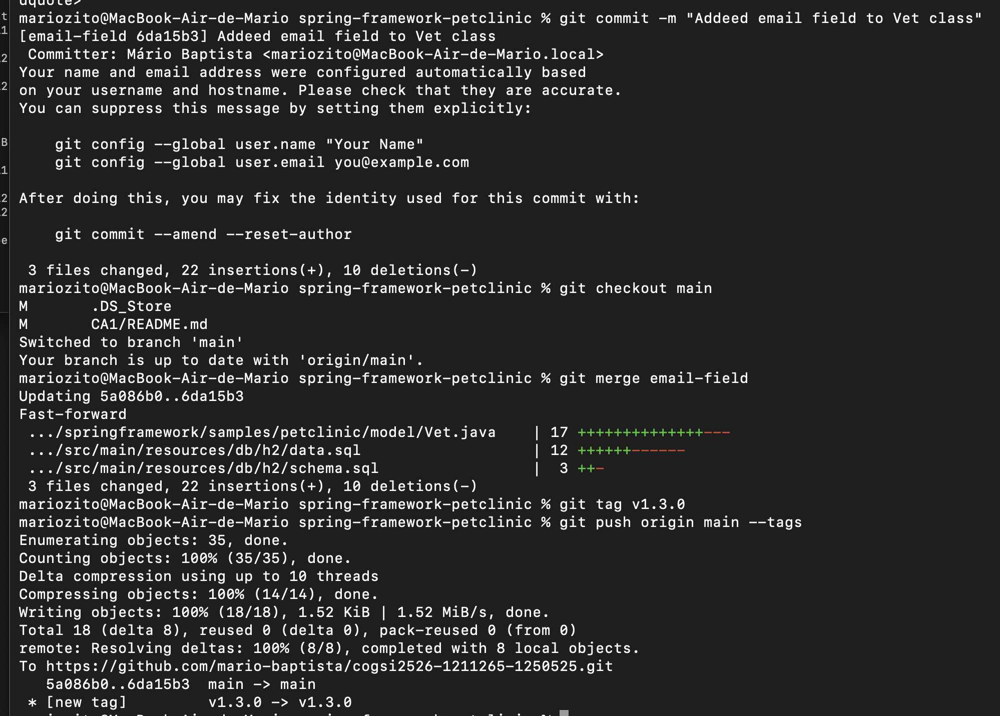
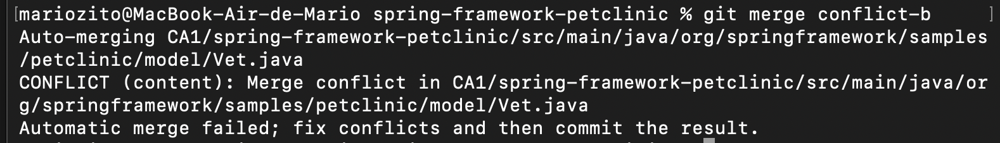

# COGSI CA1, Parte 1

Este relatório detalha a análise, o design e a implementação da primeira parte do trabalho prático de COGSI CA1, que se foca no controlo de versões com Git

## Primeiros passos

Foi inicializado o repositório (*cogsi2526-1211265-1250525*) com o comando ```git init```. 

Após a criação do repositório local, foi criado um repositório vazio no GitHub e estabelecida a sua ligação com o comando ```https://github.com/mario-baptista/cogsi2526-1211265-1250525.git```.

Após a ligação, foi realizado o 1º commit com os comandos ```git add .```, ```git commit -m "first commit"``` e ```git push -u origin main```.

Após o repositório estar conectado e verificarmos que funciona como esperado realizamos os seguintes passos:

1. Criar a pasta `CA1` no repositório do grupo.  
2. Copiar o código da aplicação **Spring Petclinic** para essa pasta.  
3. Realizar o commit do código:  
   ```bash
   git add .
   git commit -m "Ainitial version of spring-petclinic"
   git push
4. Criar a primeira tag de versão, segundo o padrão ```major.minor.revision```:
   ```sh
      git tag v1.1.0
      git push tags
    ```
5. Criar um campo chamado **professionalLicenseNumber** dentro da classe Vet.
   ```java
    @Column(name = "professionalLicenseNumber")
    @NotEmpty
    protected String professionalLicenseNumber;
    ```
    

6. Realizar git log para ver histórico de commits neste repositório.
   ```sh
    git log 
   ```

7. Realizar git revert para reverter alterações de um commit.
   ```sh
    git revert 7a8abfa91907774e097194045c4ddc21c87d6d56
   ```

8. Mostrar qual é a branch padrão do repositório e quando foi feito o seu último commit
   ```sh
   git remote show origin | grep "HEAD branch"
   ```
   Obter o último commit da branch padrão e a sua data:
   ```sh
   git log -1 --format="%H%n%an%n%ad%n%s" origin/main
   ```
   Os campos apresentados significam:
   - %H — hash completo do commit
   - %an — nome do autor
   - %ad — data completa do commit
   - %s — mensagem do commit

9. Mostrar quantos contribuintes distintos realizaram commits no repositório
   ```sh
   git shortlog -sne
   ```

10. Marcar o commit final da entrega com a tag ca1-part1
      ```sh
      # criar uma tag
      git tag -a ca1-part1 -m "CA1 - Parte 1: entrega da primeira parte"
      # enviar a tag para o repositório remoto
      git push origin ca1-part1
      ```
# Parte 2 - Branches

1. Criar a branch email-field
   ```sh
   git checkout -b email-field
   ```
   ```sh
   git add .
   git commit -m "Add email field to Vet class"
   git checkout main
   git merge email-field
   git tag v1.3.0
   git push origin main --tags
   ```

   

2. Criar conflitos de merge e resolvê-los
   Foram feitas edições propositadas em dois branches diferentes para gerar conflitos.
   Na branch conflict-a adicionamos um comentário (// Comentário conflict-a)
   Na branch conflict-b adicionamos um comentário (// Comentário conflict-b)

   Criar os branches:
   ```sh
   git checkout -b conflict-a
   git checkout main
   git checkout -b conflict-b
   ```

   Editar o branch "conflict-a":
   ```sh
   git checkout conflict-a
   # Adicionar o comentário na class Vet.java

   git add src/.../Vet.java
   git commit -m "Conflict-a"
   git push -u origin conflict-a
   ```

   Editar o branch "conflict-b":
   ```sh
   git checkout conflict-b
   # Adicionar o comentário na class Vet.java

   git add src/.../Vet.java
   git commit -m "Conflict-b"
   git push -u origin conflict-a
   ```

   Fazer o merge do conflict-a:
   ```sh
   git checkout main
   git merge conflict-a
   # Este merge aplica sem conflitos
   git push origin main
   ```

   Fazer o merge do conflict-b:
   ```sh
   git merge conflict-b
   # Merge conflict
   ```
   

   Editar o ficheiro para resolver o conflito (manteve-se os 2 comentários):

   

   Realizar o commit agora sem conflito
   ```sh
   git add .
   git commit -m "Resolve merge conflicts (kept both)"
   git push origin main
   ```
3. Verificar configuração de tracking de branches

   Para ver qual branch local segue qual branch remota:
   ```sh
   git branch -vv
   ```
   

   - main está a trackear origin/main
   - conflict-a está a trackear origin/conflict-a
   - conflict-b não está a trackear nenhuma branch remota
   - email-field não está a trackear nenhuma branch remota

   (Ao realizar git push no conflict-a usei -u mas no conflict-b não, é por essa razão que a branch conflict-a ficou ligada à branch remota (origin/conflict-a) e a branch conflict-b não.
4. Marcar entrega da Parte 2
   
   O commit final da Parte 2 foi marcado com a tag ca1-part2:
   ```sh
   git tag -a ca1-part2 -m "CA1 - Parte 2: entrega da segunda parte"
   git push origin ca1-part2
   ```