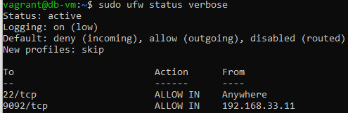

# CA3 — Part 2

### Step 1: Create Part2 Folder and Copy Base Files

First, within the local repository folder, create the Part2 folder under CA3:

```bash
mkdir -p CA3/Part2
```

Copy the necessary files from Part1:

```bash
cp CA3/Part1/Vagrantfile CA3/Part2/
cp CA3/Part1/provision.sh CA3/Part2/
cp CA3/Part1/automate_apps.sh CA3/Part2/
```

Copy the gradle_transformation application from CA2:

```bash
cp -r CA2/Part2/GradleProject_Transformation CA3/Part2/gradle_transformation
```

### Step 2: Modify Vagrantfile for Two VMs

Edit `CA3/Part2/Vagrantfile` to define two separate VMs: one for the database (started first to ensure availability) and one for the application. Include custom SSH key configuration for secure access.

The updated Vagrantfile looks like this:

```ruby

Vagrant.configure("2") do |config|
# === Ensure SSH keys exist ===
  require 'fileutils'
  ssh_dir = File.expand_path("~/.ssh")
  private_key = File.join(ssh_dir, "id_rsa_vagrant")
  public_key  = "#{private_key}.pub"

  FileUtils.mkdir_p(ssh_dir)

  unless File.exist?(private_key) && File.exist?(public_key)
    puts "==> SSH key pair not found. Generating new keys at #{private_key}..."
    system("ssh-keygen -t rsa -b 4096 -f \"#{private_key}\" -N \"\"")
  end
  config.ssh.insert_key = true
  
  config.vm.provision "shell", path: "provision.sh"

  # DB VM
  config.vm.define "db" do |db|
    db.vm.box = "bento/ubuntu-22.04"
    db.vm.hostname = "db-vm"
    db.vm.network "private_network", ip: "192.168.33.12"
    db.vm.synced_folder "./h2-data", "/vagrant/h2-data", create: true

    # Copy custom SSH public key
   db.vm.provision "file",  source: File.expand_path("~/.ssh/id_rsa_vagrant.pub"), destination: "/home/vagrant/.ssh/authorized_keys"
    db.vm.provision "shell", inline: <<-SHELL
      chmod 600 /home/vagrant/.ssh/authorized_keys
      chmod 700 /home/vagrant/.ssh
    SHELL

    # Provision Script
    db.vm.provision "shell", path: "provision.sh"

    # Automation Script for db
   db.vm.provision "shell",
    env: {
      "VM_TYPE" => "db",
      "CLONE_REPOS" => "true",
      "BUILD_APPS" => "false",
      "START_SERVICES" => "true"
    },
    inline: <<-SHELL
      cd /vagrant
      ./automate_apps.sh
    SHELL

  end

  # App VM
  config.vm.define "app" do |app|
    app.vm.box = "bento/ubuntu-22.04"
    app.vm.hostname = "app-vm"
    app.vm.network "forwarded_port", guest: 8080, host: 8080   # for REST API
    app.vm.network "private_network", ip: "192.168.33.11"

    # Copy custom SSH public key
    app.vm.provision "file", source: File.expand_path("~/.ssh/id_rsa_vagrant.pub"), destination: "/home/vagrant/.ssh/authorized_keys"
    app.vm.provision "shell", inline: <<-SHELL
      chmod 600 /home/vagrant/.ssh/authorized_keys
      chmod 700 /home/vagrant/.ssh
    SHELL

    # Provision Script
    app.vm.provision "shell", path: "provision.sh"

    # Automation Script for app
    app.vm.provision "shell", inline: <<-SHELL
      cd /vagrant
      export VM_TYPE=app
      export CLONE_REPOS=true
      export BUILD_APPS=true
      export START_SERVICES=true
      ./automate_apps.sh
    SHELL
  end
end
```

Key changes:
- Two VMs defined: "db" (started first) and "app".
- DB VM has IP 192.168.33.12 and a synced folder for H2 data persistence.
- App VM has port forwarding for the REST API and IP 192.168.33.11.
- Order ensures db VM starts before app VM to avoid timing issues.

### Step 3: Update Provision Script

Modify `CA3/Part2/provision.sh` to download the H2 database JAR file, required for the db VM.

Add the following line after installing Gradle:

```bash
#!/usr/bin/env bash

# Update packages
sudo apt-get update -y

# Install git and basic utilities
sudo apt-get install -y git curl unzip

# Install Java (JDK 17)
sudo apt-get install -y openjdk-17-jdk

# Install Maven
sudo apt-get install -y maven

# Install Gradle
sudo apt-get install -y gradle

sudo apt-get install -y dos2unix
dos2unix /vagrant/*.sh

# Download and install H2 database
wget -q https://repo1.maven.org/maven2/com/h2database/h2/2.2.224/h2-2.2.224.jar -O /usr/local/bin/h2.jar

# Check installations
java -version
mvn -version
gradle -v
git --version
```

### Step 4: Update Automation Script

Modify `CA3/Part2/automate_apps.sh` to handle the two VM types with proper sequencing and H2 configuration.

Add VM_TYPE variable:

```bash
VM_TYPE=${VM_TYPE:-app}
```

Update the BASE_DIR to Part2:

```bash
BASE_DIR=/home/vagrant/cogsi2526-1211265-1250525-1250204/CA3/Part2
```

Modify the cloning section to conditionally copy and configure based on VM_TYPE:

For app VM: Copy gradle_transformation and configure application.properties for H2 server mode (JDBC URL: `jdbc:h2:tcp://192.168.33.12:9092/h2db`).

For db VM: Prepare the H2 data directory.

Modify build section: Only build on app VM.

Modify start services:
- For db VM: Start H2 server with flags `-tcpAllowOthers` (allow remote connections) and `-ifNotExists` (allow database creation).
- For app VM: Wait for H2 server to be ready (using `nc` to check port 9092), then start gradle_transformation.

### Step 5: Start the VMs

Navigate to the Part2 folder and run Vagrant:

```bash
cd CA3/Part2
vagrant up
```

This will start both VMs. The app VM will build and run the gradle_transformation application, connecting to the H2 server on the db VM.

### Step 6: Verify the Setup

- Check VM status: `vagrant status`
- SSH into VMs: `vagrant ssh app` or `vagrant ssh db`
- Access the app: `http://localhost:8080/employees`


### Step 7: Implement Custom SSH Keys for Secure Access

To enhance VM security and prevent unauthorized access, replace Vagrant's default insecure SSH keys with custom-generated keys. The keys are securely provisioned without embedding in the Vagrantfile.

#### Step 7.1: Generate Custom SSH Key Pair

Generate a new RSA key pair specifically for Vagrant VMs:

```bash
ssh-keygen -t rsa -b 4096 -f ~/.ssh/id_rsa_vagrant -N ""
```

This creates:
- Private key: `~/.ssh/id_rsa_vagrant`
- Public key: `~/.ssh/id_rsa_vagrant.pub`

#### Step 7.2: Vagrantfile Configuration

The Vagrantfile is already configured to use custom SSH keys:

- `config.ssh.private_key_path = "~/.ssh/id_rsa_vagrant"`: Specifies the custom private key.
- `config.ssh.insert_key = true`: Allows initial connection with insecure key, then switches to custom.
- For each VM, provisions copy the public key file to `/home/vagrant/.ssh/authorized_keys` and set permissions.

This approach avoids storing the key content in the Vagrantfile.

In the following code in the *Vagrant file* the initialization check was added to ensure that the application virtual machine waits for the database H2 service.

The *nc -z* checks if the port is open. Therefore, the app only starts when the H2 is ready to receive connections.

```ruby
if [ "$START_SERVICES" = "true" ]; then
    cd $BASE_DIR
    echo "Starting services..."

    if [ "$VM_TYPE" = "app" ]; then
        echo "Waiting for H2 database server to be ready..."
        while ! nc -z 192.168.33.12 9092; do
            sleep 2
        done
      echo "H2 server is ready."
```

The following code demonstrates the installation of the firewall package, it shows the command that blocks everything that enters the virtual machine (sudo ufw default deny incoming command), unless there are exceptions that do not count on access to the H2 database from port 9092. The implementation of the two firewall rules mentioned above. Furthermore, the *sudo ufw default allow outgoing* command allows everything that leaves the virtual machine to be allowed. In fact, it is important to mention that blocking everything first was a relevant first step that emphasizes the security of the system. However, later, as the statement asked us to have a permission firewall rule, it ended up being implemented, however, there ended up being two rules.

Then, two firewall rules were added:
- **traffic permission only to allow connections from the App VM to the H2 database port (port 9092) through the command *sudo ufw allow from 192.168.33.11 to any port 9092 proto tcp***;
- traffic permission by activating the SSH protocol port (port 22) through the *sudo ufw allow 22/tcp* command, so that SSH access (which Vagrant uses to connect to the VM) isn't blocked.


```bash
  echo "Configuring firewall (ufw) to secure the H2 database..."

    # Install UFW if it is not already installed
    sudo apt-get update -y
    sudo apt-get install -y ufw

    # Set secure default policies
    sudo ufw default deny incoming
    sudo ufw default allow outgoing

    # Allow SSH (remote access)
    sudo ufw allow 22/tcp

    # Allow only the app VM (192.168.33.11) to access the H2 port
    sudo ufw allow from 192.168.33.11 to any port 9092 proto tcp

    echo "y" | sudo ufw enable

    # Start H2 server in background
    SYNC_DIR="/vagrant"
    H2_DATA_DIR="$SYNC_DIR/h2-data"
    java -cp /usr/local/bin/h2.jar org.h2.tools.Server -tcp -tcpPort 9092 -tcpAllowOthers -ifNotExists -baseDir "$H2_DATA_DIR" &
    echo "H2 database server started on port 9092 and restricted to app VM."
```

At the end, we typed the command **vagrant ssh db** to enter the database virtual machine, and later the following command was executed:

```bash
sudo ufw status verbose
```

This command is used to see the implemented firewall rules, and more importantly, see the ports that are actually open.

The following output result demonstrated in the image shows the desired result.

