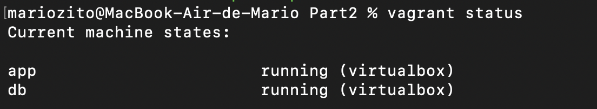
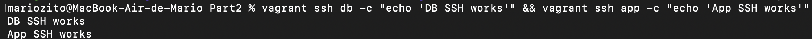
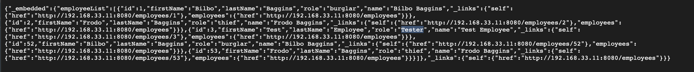
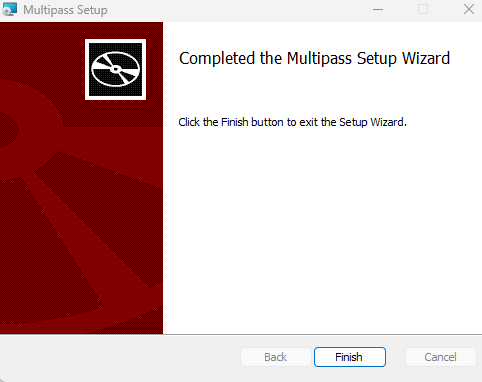
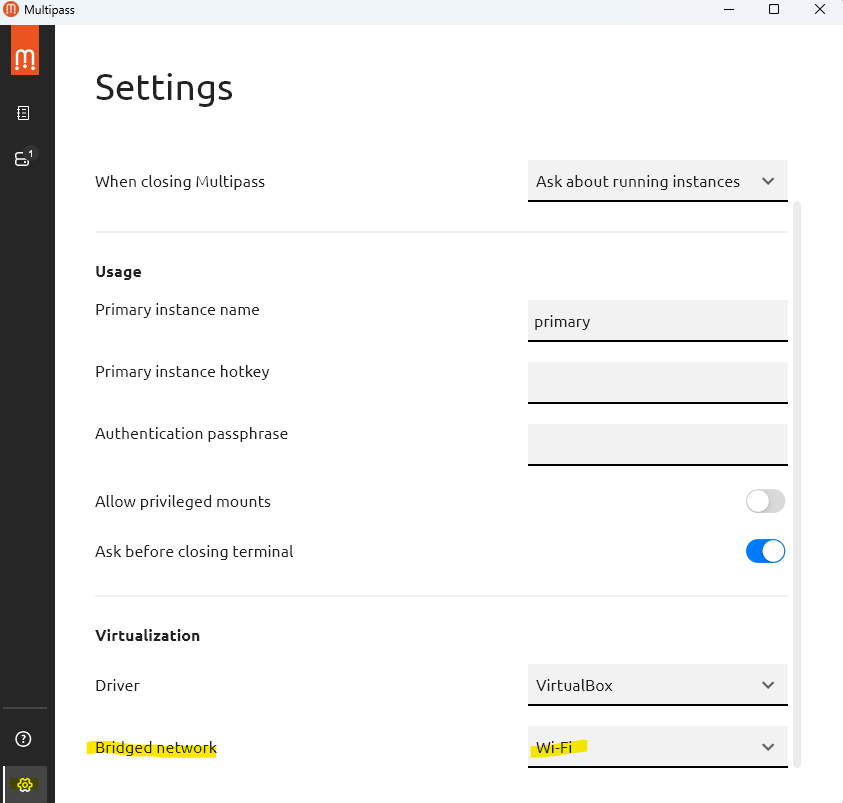
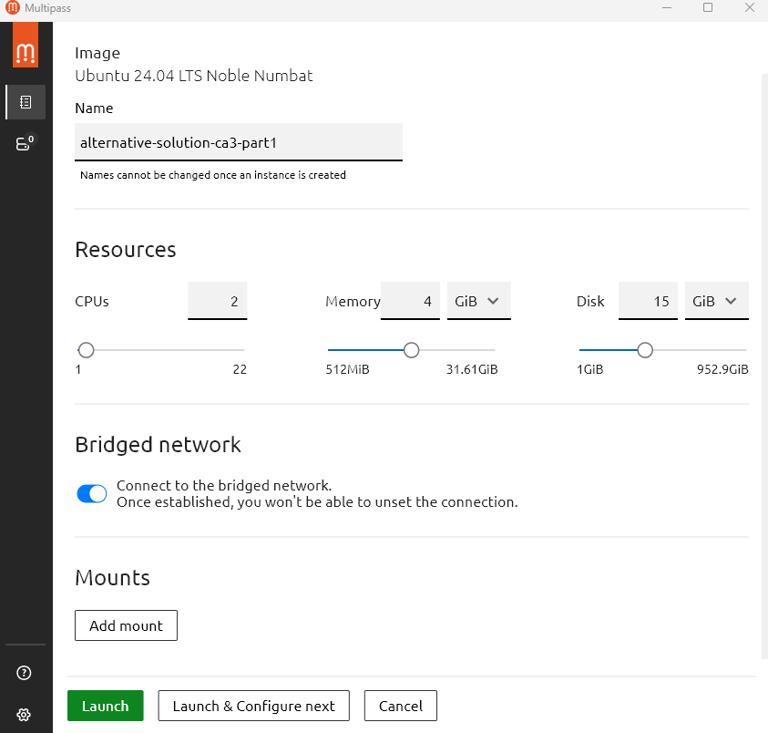
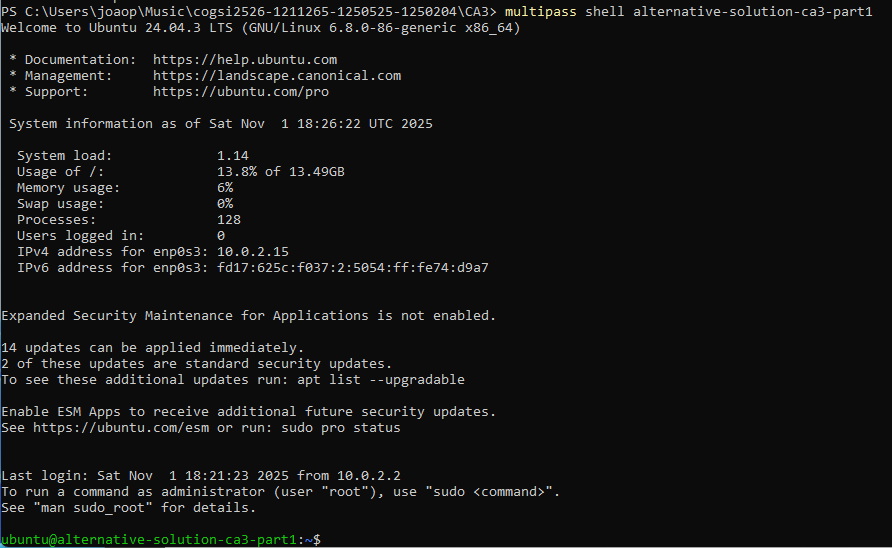
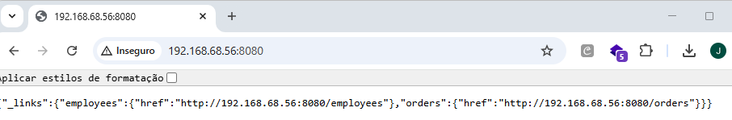
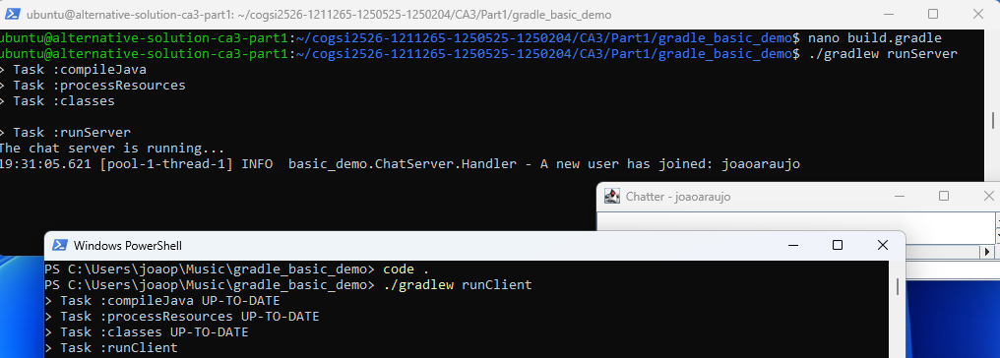

# CA3 README.md with Part1, Part2 and Alternative Solution

# CA3 — Part 1

In this Class Assignment 3, Vagrant was discussed, which is an open source tool that simplifies the creation and management of virtualized and portable development environments. What we implemented in Class Assignment 2 started to be implemented in this Class Assignment 3, only within the vagrant environment.

### Box initialization in the Part1 folder of CA3 

First, within the local folder of this repository, we created the Part1 folder. Then, vagrant was installed on the host machine, and only later did the following command be executed within the Part1 folder:

```bash
vagrant init bento/ubuntu-22.04
```


### Verify Version and Installation

We run the command to check the vagrant version and make sure that it was installed on the computer.

```bash
vagrant --version
```

The version that appears is 2.4.9 and it's clear that vagrant has actually been installed.


The Vagrantfile was opened in a development environment, and the following configuration script was created to define the virtual machine settings. These include specifying the Vagrant box to be used, setting the hostname of the machine, assigning a private network IP address (192.168.56.10), and forwarding ports to allow access to services such as the REST API (port 8080) and a simple chat application (port 5000).
Additionally, the configuration includes a provisioning script (*provision.sh*) responsible for automatically installing and setting up essential development tools such as Git, JDK, Maven, and Gradle.

```ruby
# -*- mode: ruby -*-
# vi: set ft=ruby :

# All Vagrant configuration is done below. The "2" in Vagrant.configure
# configures the configuration version (we support older styles for
# backwards compatibility). Please don't change it unless you know what
# you're doing.

Vagrant.configure("2") do |config|
  config.vm.box = "bento/ubuntu-22.04"
  config.vm.hostname = "vagrant-machine"
  config.vm.network "forwarded_port", guest: 8080, host: 8080   # for REST API
  config.vm.network "forwarded_port", guest: 5000, host: 5000   # for simple chat
  config.vm.network "private_network", ip: "192.168.56.10"

  # Provision Script
  config.vm.provision "shell", path: "provision.sh"
end
```

The provisioning shell script, where file is *provision.sh*, uses the following initial code:

```bash
#!/usr/bin/env bash
# Update packages
sudo apt-get update -y

# Install git and basic utilities
sudo apt-get install -y git curl unzip

# Install Java (JDK 17)
sudo apt-get install -y openjdk-17-jdk

# Install Maven
sudo apt-get install -y maven

# Install Gradle
sudo apt-get install -y gradle

# Check installations
java -version
mvn -version
gradle -v
git --version
```


After configuring the file demonstrated previously, a command was executed to start the Vagrant virtual machine with the Ubuntu operating system version 22.04 (not 22.08) and the Vagrantfile settings in the virtualization provider called VirtualBox. The command used was:

```bash
vagrant up
```

This command performs several tasks automatically: it creates the virtual machine if it does not already exist, starts it if it is stopped, sets up the network configuration (in this case, a private IP) and executes any provisioning scripts defined in the Vagrantfile. In this example, provisioning installs Git, JDK, Maven, and Gradle, ensuring that the development environment is ready to use immediately. In another situation, if you are using a computer with the macOS operating system, you could use the virtualization provider VMware Fusion or Parallels, which is even advisable, as they offer better performance and tighter integration with the host system. To use these providers, you may need to install the corresponding Vagrant plugin and specify the provider when running the vagrant up command:

After executing the command shown above, the Oracle VirtualBox Machine program is opened, asks in administrator mode if you want to run the Vagrant virtual machine, and only then does the Vagrant machine run automatically and in the terminal where you are working (in this case Powershell is used), all information is processed simultaneously. The following image appears and means that the virtual machine was automatically created in *Oracle VBox Machine*.


Then, the following command was executed to log in to the vagrant machine.

```bash
vagrant ssh
```

And the result of the exit was what was desired, the execution was successful.


On the vagrant machine, we cloned our repository with the command:

```bash
git clone https://github.com/mario-baptista/cogsi2526-1211265-1250525-1250204.git
```

Next, we moved to the Part1 folder within CA3, and git cloned the REST API developed in Spring Boot and the simple chat application in Gradle.

```bash
cd cogsi2526-1211265-1250525-1250204/CA3/Part1
git clone https://github.com/spring-guides/tut-rest
git clone https://github.com/lmpnogueira/gradle_basic_demo
```

To execute the API and run it on the host machine side, we went to the gradle project in links folder and ran the command:

```bash
../mvnw spring-boot:run
```

The result was:

```
vagrant@vagrant-machine:~/cogsi2526-1211265-1250525-1250204/CA3/Part1/tut-rest/links$ ../mvnw spring-boot:run
[INFO] Scanning for projects...
[INFO]
[INFO] ------------------< org.springframework.guides:links >------------------
[INFO] Building links 0.0.1-SNAPSHOT
[INFO]   from pom.xml
[INFO] --------------------------------[ jar ]---------------------------------
[INFO]
[INFO] >>> spring-boot:3.2.5:run (default-cli) > test-compile @ links >>>
[INFO]
[INFO] --- resources:3.3.1:resources (default-resources) @ links ---
[INFO] skip non existing resourceDirectory /home/vagrant/cogsi2526-1211265-1250525-1250204/CA3/Part1/tut-rest/links/src/main/resources
[INFO] skip non existing resourceDirectory /home/vagrant/cogsi2526-1211265-1250525-1250204/CA3/Part1/tut-rest/links/src/main/resources
[INFO]
[INFO] --- compiler:3.11.0:compile (default-compile) @ links ---
[INFO] Nothing to compile - all classes are up to date
[INFO]
[INFO] --- resources:3.3.1:testResources (default-testResources) @ links ---
[INFO] skip non existing resourceDirectory /home/vagrant/cogsi2526-1211265-1250525-1250204/CA3/Part1/tut-rest/links/src/test/resources
[INFO]
[INFO] --- compiler:3.11.0:testCompile (default-testCompile) @ links ---
[INFO] No sources to compile
[INFO]
[INFO] <<< spring-boot:3.2.5:run (default-cli) < test-compile @ links <<<
[INFO]
[INFO]
[INFO] --- spring-boot:3.2.5:run (default-cli) @ links ---
[INFO] Attaching agents: []

  .   ____          _            __ _ _
 /\\ / ___'_ __ _ _(_)_ __  __ _ \ \ \ \
( ( )\___ | '_ | '_| | '_ \/ _` | \ \ \ \
 \\/  ___)| |_)| | | | | || (_| |  ) ) ) )
  '  |____| .__|_| |_|_| |_\__, | / / / /
 =========|_|==============|___/=/_/_/_/
 :: Spring Boot ::                (v3.2.5)

2025-10-30T17:53:33.328Z  INFO 9080 --- [           main] payroll.PayrollApplication               : Starting PayrollApplication using Java 17.0.16 with PID 9080 (/home/vagrant/cogsi2526-1211265-1250525-1250204/CA3/Part1/tut-rest/links/target/classes started by vagrant in /home/vagrant/cogsi2526-1211265-1250525-1250204/CA3/Part1/tut-rest/links)
2025-10-30T17:53:33.348Z  INFO 9080 --- [           main] payroll.PayrollApplication               : No active profile set, falling back to 1 default profile: "default"
2025-10-30T17:53:35.128Z  INFO 9080 --- [           main] .s.d.r.c.RepositoryConfigurationDelegate : Bootstrapping Spring Data JPA repositories in DEFAULT mode.
2025-10-30T17:53:35.274Z  INFO 9080 --- [           main] .s.d.r.c.RepositoryConfigurationDelegate : Finished Spring Data repository scanning in 128 ms. Found 2 JPA repository interfaces.
2025-10-30T17:53:36.449Z  INFO 9080 --- [           main] o.s.b.w.embedded.tomcat.TomcatWebServer  : Tomcat initialized with port 8080 (http)
2025-10-30T17:53:36.478Z  INFO 9080 --- [           main] o.apache.catalina.core.StandardService   : Starting service [Tomcat]
2025-10-30T17:53:36.480Z  INFO 9080 --- [           main] o.apache.catalina.core.StandardEngine    : Starting Servlet engine: [Apache Tomcat/10.1.20]
2025-10-30T17:53:36.604Z  INFO 9080 --- [           main] o.a.c.c.C.[Tomcat].[localhost].[/]       : Initializing Spring embedded WebApplicationContext
2025-10-30T17:53:36.607Z  INFO 9080 --- [           main] w.s.c.ServletWebServerApplicationContext : Root WebApplicationContext: initialization completed in 3010 ms
2025-10-30T17:53:36.894Z  INFO 9080 --- [           main] com.zaxxer.hikari.HikariDataSource       : HikariPool-1 - Starting...
2025-10-30T17:53:37.371Z  INFO 9080 --- [           main] com.zaxxer.hikari.pool.HikariPool        : HikariPool-1 - Added connection conn0: url=jdbc:h2:mem:c71b8e0c-0789-4892-aef8-1d92616e4799 user=SA
2025-10-30T17:53:37.379Z  INFO 9080 --- [           main] com.zaxxer.hikari.HikariDataSource       : HikariPool-1 - Start completed.
2025-10-30T17:53:37.483Z  INFO 9080 --- [           main] o.hibernate.jpa.internal.util.LogHelper  : HHH000204: Processing PersistenceUnitInfo [name: default]
2025-10-30T17:53:37.605Z  INFO 9080 --- [           main] org.hibernate.Version                    : HHH000412: Hibernate ORM core version 6.4.4.Final
2025-10-30T17:53:37.677Z  INFO 9080 --- [           main] o.h.c.internal.RegionFactoryInitiator    : HHH000026: Second-level cache disabled
2025-10-30T17:53:38.159Z  INFO 9080 --- [           main] o.s.o.j.p.SpringPersistenceUnitInfo      : No LoadTimeWeaver setup: ignoring JPA class transformer
2025-10-30T17:53:40.442Z  INFO 9080 --- [           main] o.h.e.t.j.p.i.JtaPlatformInitiator       : HHH000489: No JTA platform available (set 'hibernate.transaction.jta.platform' to enable JTA platform integration)
2025-10-30T17:53:40.551Z  INFO 9080 --- [           main] j.LocalContainerEntityManagerFactoryBean : Initialized JPA EntityManagerFactory for persistence unit 'default'
2025-10-30T17:53:41.243Z  WARN 9080 --- [           main] JpaBaseConfiguration$JpaWebConfiguration : spring.jpa.open-in-view is enabled by default. Therefore, database queries may be performed during view rendering. Explicitly configure spring.jpa.open-in-view to disable this warning
2025-10-30T17:53:42.408Z  INFO 9080 --- [           main] o.s.b.w.embedded.tomcat.TomcatWebServer  : Tomcat started on port 8080 (http) with context path ''
2025-10-30T17:53:42.433Z  INFO 9080 --- [           main] payroll.PayrollApplication               : Started PayrollApplication in 9.99 seconds (process running for 10.928)
2025-10-30T17:53:42.873Z  INFO 9080 --- [           main] payroll.LoadDatabase                     : Preloaded Employee{id=1, firstName='Bilbo', lastName='Baggins', role='burglar'}
2025-10-30T17:53:42.879Z  INFO 9080 --- [           main] payroll.LoadDatabase                     : Preloaded Employee{id=2, firstName='Frodo', lastName='Baggins', role='thief'}
2025-10-30T17:53:42.902Z  INFO 9080 --- [           main] payroll.LoadDatabase                     : Preloaded Order{id=1, description='MacBook Pro', status=COMPLETED}
2025-10-30T17:53:42.903Z  INFO 9080 --- [           main] payroll.LoadDatabase                     : Preloaded Order{id=2, description='iPhone', status=IN_PROGRESS}
^C2025-10-30T17:53:51.120Z  INFO 9080 --- [ionShutdownHook] j.LocalContainerEntityManagerFactoryBean : Closing JPA EntityManagerFactory for persistence unit 'default'
2025-10-30T17:53:51.140Z  INFO 9080 --- [ionShutdownHook] com.zaxxer.hikari.HikariDataSource       : HikariPool-1 - Shutdown initiated...
2025-10-30T17:53:51.152Z  INFO 9080 --- [ionShutdownHook] com.zaxxer.hikari.HikariDataSource       : HikariPool-1 - Shutdown completed.
[INFO] ------------------------------------------------------------------------
[INFO] BUILD SUCCESS
[INFO] ------------------------------------------------------------------------
[INFO] Total time:  23.266 s
[INFO] Finished at: 2025-10-30T17:53:51Z
[INFO] ------------------------------------------------------------------------
```

Subsequently, in a browser of your choice, type the following link into the search engine on the host PC:

```
https://192.168.56.10:8080
```

And, the result of this research that should emerge, must include the following:


On the Vagrant machine, two tasks were added within the gradle project, in the build.gradle file: runServer and runClient. We pass the argument 5000, as it is the port on which the server will listen for connections.

```java
tasks.register('runServer', JavaExec) {
    classpath = sourceSets.main.runtimeClasspath
    mainClass = 'basic_demo.ChatServerApp'
    args '5000'
}

tasks.register('runClient', JavaExec) {
    classpath = sourceSets.main.runtimeClasspath
    mainClass = 'basic_demo.ChatClientApp'
    args '192.168.56.10', '5000'
}
```

Finally, on the server side, the command below was reproduced to run the server:

```bash
./gradlew runServer
```
The result is what happens in the following image:


In PowerShell on Windows (client side), git clone the repository in a random local folder:

```bash
git clone https://github.com/lmpnogueira/gradle_basic_demo
```


Next, we insert the following code into the client-side build.gradle file:

```java
task runClient(type:JavaExec, dependsOn: classes){
    classpath = sourceSets.main.runtimeClasspath
    mainClass = 'basic_demo.ChatClientApp'
    args '192.168.56.10', '5000'
}
```

Later, on the client side, the command was executed to compile gradle (*./gradlew build*) and see if any errors appeared. As nothing came up, the following command was run:

```bash
./gradlew runClient
```

The result was the following: 


As shown in the image above on the left side, a popup appears for the user to enter their name, with the aim of starting the chat conversation later.

In the simple chat application, the name *joaoaraujo* was entered as the screen name, and immediately afterwards, on the vagrant machine, the server gave an alert saying that a user had just entered.


### Automating Cloning, Building, and Starting Applications

To automate the process of cloning repositories, building applications, and starting services, use the `automate_apps.sh` script with environment variables.

1. **Set Environment Variables**: Control which steps run by setting boolean flags (`true` or `false`). Defaults are `false`.
   - `CLONE_REPOS=true`: Clone Spring PetClinic, Payroll (tut-rest), and Gradle Basic Demo repos.
   - `BUILD_APPS=true`: Build the applications using Maven/Gradle.
   - `START_SERVICES=true`: Start services in the background (PetClinic and Payroll on port 8080, Chat Server on port 5000).

2. **Run the Automation Script**:
   - After `vagrant ssh`, navigate to the Part1 folder: `cd cogsi2526-1211265-1250525-1250204/CA3/Part1`
   - Execute with vars: `CLONE_REPOS=true BUILD_APPS=true START_SERVICES=true ./automate_apps.sh`
   - Or integrate into Vagrantfile provisioning (see Vagrantfile updates above).

3. **Verify**:
   - Check processes: `ps aux | grep java` or `ps aux | grep gradle`.
   - Access services: `http://192.168.56.10:8080` for APIs, connect chat client to `192.168.56.10:5000`.
   - Logs: Check terminal output or app logs for errors.

4. **Customization**: Modify `automate_apps.sh` for additional apps or repo URLs. Ensure ports don't conflict.

This automation reduces manual steps, making the Vagrant environment more reproducible.

To test that the applications are running on the server, we changed the build.gradle on `gradle_basic_demo` to use the server IP address instead of `localhost`:


And we can also use the browser to check the REST application:


## H2 Database Persistence Setup for gradle_transformation

This section explains how to configure the H2 database in the VM to retain data across restarts using a synced folder for persistent storage.

### Step-by-Step Tutorial

1. **Modify Vagrantfile for Synced Folder**:
   - Open `CA3/Part1/Vagrantfile`.
   - Add the following line after the network configurations:
     ```
     config.vm.synced_folder "./h2-data", "/vagrant/h2-data", create: true
     ```
   - This creates a synced folder between the host's `./h2-data` directory and the VM's `/vagrant/h2-data`, allowing data persistence.

2. **Update Provisioning Script**:
   - The `automate_apps.sh` script has been modified to automatically configure H2 persistence when cloning repositories.
   - After copying `gradle_transformation`, it:
     - Creates the `/vagrant/h2-data` directory with appropriate permissions.
     - Appends H2 database configuration to `gradle_transformation/src/main/resources/application.properties` if not already present.
   - Configuration includes:
     - Database URL pointing to the synced folder: `jdbc:h2:file:/vagrant/h2-data/h2db;DB_CLOSE_DELAY=-1;AUTO_SERVER=TRUE`
     - H2 console enabled at `http://localhost:8080/h2`
     - JPA settings for automatic DDL updates.

Now, if we create a new employee:


And restart the application


The employee is still there


Database file on CA3/Part1/h2-data


# CA3 — Part 2

### Step 1: Create Part2 Folder and Copy Base Files

First, within the local repository folder, create the Part2 folder under CA3:

```bash
mkdir -p CA3/Part2
```

Copy the necessary files from Part1:

```bash
cp CA3/Part1/Vagrantfile CA3/Part2/
cp CA3/Part1/provision.sh CA3/Part2/
cp CA3/Part1/automate_apps.sh CA3/Part2/
```

Copy the gradle_transformation application from CA2:

```bash
cp -r CA2/Part2/GradleProject_Transformation CA3/Part2/gradle_transformation
```

### Step 2: Modify Vagrantfile for Two VMs

Edit `CA3/Part2/Vagrantfile` to define two separate VMs: one for the database (started first to ensure availability) and one for the application. Include custom SSH key configuration for secure access.

The updated Vagrantfile looks like this:

```ruby

Vagrant.configure("2") do |config|
# === Ensure SSH keys exist ===
  require 'fileutils'
  ssh_dir = File.expand_path("~/.ssh")
  private_key = File.join(ssh_dir, "id_rsa_vagrant")
  public_key  = "#{private_key}.pub"

  FileUtils.mkdir_p(ssh_dir)

  unless File.exist?(private_key) && File.exist?(public_key)
    puts "==> SSH key pair not found. Generating new keys at #{private_key}..."
    system("ssh-keygen -t rsa -b 4096 -f \"#{private_key}\" -N \"\"")
  end
  config.ssh.insert_key = true
  
  config.vm.provision "shell", path: "provision.sh"

  # DB VM
  config.vm.define "db" do |db|
    db.vm.box = "bento/ubuntu-22.04"
    db.vm.hostname = "db-vm"
    db.vm.network "private_network", ip: "192.168.33.12"
    db.vm.synced_folder "./h2-data", "/vagrant/h2-data", create: true

    # Copy custom SSH public key
   db.vm.provision "file",  source: File.expand_path("~/.ssh/id_rsa_vagrant.pub"), destination: "/home/vagrant/.ssh/authorized_keys"
    db.vm.provision "shell", inline: <<-SHELL
      chmod 600 /home/vagrant/.ssh/authorized_keys
      chmod 700 /home/vagrant/.ssh
    SHELL

    # Provision Script
    db.vm.provision "shell", path: "provision.sh"

    # Automation Script for db
   db.vm.provision "shell",
    env: {
      "VM_TYPE" => "db",
      "CLONE_REPOS" => "true",
      "BUILD_APPS" => "false",
      "START_SERVICES" => "true"
    },
    inline: <<-SHELL
      cd /vagrant
      ./automate_apps.sh
    SHELL

  end

  # App VM
  config.vm.define "app" do |app|
    app.vm.box = "bento/ubuntu-22.04"
    app.vm.hostname = "app-vm"
    app.vm.network "forwarded_port", guest: 8080, host: 8080   # for REST API
    app.vm.network "private_network", ip: "192.168.33.11"

    # Copy custom SSH public key
    app.vm.provision "file", source: File.expand_path("~/.ssh/id_rsa_vagrant.pub"), destination: "/home/vagrant/.ssh/authorized_keys"
    app.vm.provision "shell", inline: <<-SHELL
      chmod 600 /home/vagrant/.ssh/authorized_keys
      chmod 700 /home/vagrant/.ssh
    SHELL

    # Provision Script
    app.vm.provision "shell", path: "provision.sh"

    # Automation Script for app
    app.vm.provision "shell", inline: <<-SHELL
      cd /vagrant
      export VM_TYPE=app
      export CLONE_REPOS=true
      export BUILD_APPS=true
      export START_SERVICES=true
      ./automate_apps.sh
    SHELL
  end
end
```

Key changes:
- Two VMs defined: "db" (started first) and "app".
- DB VM has IP 192.168.33.12 and a synced folder for H2 data persistence.
- App VM has port forwarding for the REST API and IP 192.168.33.11.
- Order ensures db VM starts before app VM to avoid timing issues.

### Step 3: Update Provision Script

Modify `CA3/Part2/provision.sh` to download the H2 database JAR file, required for the db VM.

Add the following line after installing Gradle:

```bash
#!/usr/bin/env bash

# Update packages
sudo apt-get update -y

# Install git and basic utilities
sudo apt-get install -y git curl unzip

# Install Java (JDK 17)
sudo apt-get install -y openjdk-17-jdk

# Install Maven
sudo apt-get install -y maven

# Install Gradle
sudo apt-get install -y gradle

sudo apt-get install -y dos2unix
dos2unix /vagrant/*.sh

# Download and install H2 database
wget -q https://repo1.maven.org/maven2/com/h2database/h2/2.2.224/h2-2.2.224.jar -O /usr/local/bin/h2.jar

# Check installations
java -version
mvn -version
gradle -v
git --version
```

### Step 4: Update Automation Script

Modify `CA3/Part2/automate_apps.sh` to handle the two VM types with proper sequencing and H2 configuration.

Add VM_TYPE variable:

```bash
VM_TYPE=${VM_TYPE:-app}
```

Update the BASE_DIR to Part2:

```bash
BASE_DIR=/home/vagrant/cogsi2526-1211265-1250525-1250204/CA3/Part2
```

Modify the cloning section to conditionally copy and configure based on VM_TYPE:

For app VM: Copy gradle_transformation and configure application.properties for H2 server mode (JDBC URL: `jdbc:h2:tcp://192.168.33.12:9092/h2db`).

For db VM: Prepare the H2 data directory.

Modify build section: Only build on app VM.

Modify start services:
- For db VM: Start H2 server with flags `-tcpAllowOthers` (allow remote connections) and `-ifNotExists` (allow database creation).
- For app VM: Wait for H2 server to be ready (using `nc` to check port 9092), then start gradle_transformation.

### Step 5: Start the VMs

Navigate to the Part2 folder and run Vagrant:

```bash
cd CA3/Part2
vagrant up
```

This will start both VMs. The app VM will build and run the gradle_transformation application, connecting to the H2 server on the db VM.

### Step 6: Verify the Setup

- Check VM status: `vagrant status`
- SSH into VMs: `vagrant ssh app` or `vagrant ssh db`
- Access the app: `http://localhost:8080/employees`







### Step 7: Implement Custom SSH Keys for Secure Access

To enhance VM security and prevent unauthorized access, replace Vagrant's default insecure SSH keys with custom-generated keys. The keys are securely provisioned without embedding in the Vagrantfile.

#### Step 7.1: Generate Custom SSH Key Pair

Generate a new RSA key pair specifically for Vagrant VMs:

```bash
ssh-keygen -t rsa -b 4096 -f ~/.ssh/id_rsa_vagrant -N ""
```

This creates:
- Private key: `~/.ssh/id_rsa_vagrant`
- Public key: `~/.ssh/id_rsa_vagrant.pub`

#### Step 7.2: Vagrantfile Configuration

The Vagrantfile is already configured to use custom SSH keys:

- `config.ssh.private_key_path = "~/.ssh/id_rsa_vagrant"`: Specifies the custom private key.
- `config.ssh.insert_key = true`: Allows initial connection with insecure key, then switches to custom.
- For each VM, provisions copy the public key file to `/home/vagrant/.ssh/authorized_keys` and set permissions.

This approach avoids storing the key content in the Vagrantfile.

In the following code in the *Vagrant file* the initialization check was added to ensure that the application virtual machine waits for the database H2 service.

The *nc -z* checks if the port is open. Therefore, the app only starts when the H2 is ready to receive connections.

```ruby
if [ "$START_SERVICES" = "true" ]; then
    cd $BASE_DIR
    echo "Starting services..."

    if [ "$VM_TYPE" = "app" ]; then
        echo "Waiting for H2 database server to be ready..."
        while ! nc -z 192.168.33.12 9092; do
            sleep 2
        done
      echo "H2 server is ready."
```

The following code demonstrates the installation of the firewall package, it shows the command that blocks everything that enters the virtual machine (sudo ufw default deny incoming command), unless there are exceptions that do not count on access to the H2 database from port 9092. The implementation of the two firewall rules mentioned above. Furthermore, the *sudo ufw default allow outgoing* command allows everything that leaves the virtual machine to be allowed. In fact, it is important to mention that blocking everything first was a relevant first step that emphasizes the security of the system. However, later, as the statement asked us to have a permission firewall rule, it ended up being implemented, however, there ended up being two rules.

Then, two firewall rules were added:
- **traffic permission only to allow connections from the App VM to the H2 database port (port 9092) through the command *sudo ufw allow from 192.168.33.11 to any port 9092 proto tcp***;
- traffic permission by activating the SSH protocol port (port 22) through the *sudo ufw allow 22/tcp* command, so that SSH access (which Vagrant uses to connect to the VM) isn't blocked.


```bash
  echo "Configuring firewall (ufw) to secure the H2 database..."

    # Install UFW if it is not already installed
    sudo apt-get update -y
    sudo apt-get install -y ufw

    # Set secure default policies
    sudo ufw default deny incoming
    sudo ufw default allow outgoing

    # Allow SSH (remote access)
    sudo ufw allow 22/tcp

    # Allow only the app VM (192.168.33.11) to access the H2 port
    sudo ufw allow from 192.168.33.11 to any port 9092 proto tcp

    echo "y" | sudo ufw enable

    # Start H2 server in background
    SYNC_DIR="/vagrant"
    H2_DATA_DIR="$SYNC_DIR/h2-data"
    java -cp /usr/local/bin/h2.jar org.h2.tools.Server -tcp -tcpPort 9092 -tcpAllowOthers -ifNotExists -baseDir "$H2_DATA_DIR" &
    echo "H2 database server started on port 9092 and restricted to app VM."
```

At the end, we typed the command **vagrant ssh db** to enter the database virtual machine, and later the following command was executed:

```bash
sudo ufw status verbose
```

This command is used to see the implemented firewall rules, and more importantly, see the ports that are actually open.


The following output result demonstrated in the image shows the desired result.


# Alternative Solution - Multipass

An alternative to the Vagrant virtualization tool is Multipass, a lightweight virtual machine manager developed by Canonical, the company behind Ubuntu.
Multipass is designed to quickly launch and manage Ubuntu virtual machines (VMs) across multiple operating systems — Windows, macOS, and Linux — using existing virtualization backends such as Hyper-V, QEMU, VirtualBox, or Apple Hypervisor.

The tool provides a simplified way to create reproducible, isolated, and fast environments, ideal for development, testing, and CI/CD pipelines.

## Comparison Between Multipass and Vagrant

| **Criteria** | **Vagrant** | **Multipass** |
|---------------|--------------|----------------|
| **Developer** | HashiCorp | Canonical |
| **Main Purpose** | Environment provisioning and automation | Lightweight Ubuntu VM management |
| **Virtualization Backends** | VirtualBox, Hyper-V, VMware, Docker | Hyper-V, QEMU, VirtualBox, Apple Hypervisor |
| **Default Images** | Custom “boxes” (various OS distributions) | Official minimal Ubuntu images |
| **Provisioning Support** | Supports Shell, Ansible, Puppet, Chef | Uses cloud-init for setup |
| **Resource Usage** | Can be resource-heavy | Lightweight and fast |
| **Ease of Use** | Requires configuration via Vagrantfile | Simple CLI commands |
| **Focus** | Reproducible development environments | Rapid deployment of isolated Ubuntu instances |
| **Container Integration** | Integrates with Docker easily | Can host Docker within the VM |
| **Networking & Shared Folders** | Configurable through Vagrantfile | Automatic mounting of local directories |


There are differences that are essential to know, because we are talking about different functionalities and it is not possible to replicate exactly in the same way in Multipass what was developed in Vagrant.

| Feature                     | Vagrant                                   | Multipass                                   |
|-------------------------------|-------------------------------------------|--------------------------------------------|
| Automatic Provisioning        | Yes, via Vagrantfile + shell script       | Only if using cloud-init                    |
| Package Installation          | Script written on host, executed in VM    | Without cloud-init: manual; with cloud-init: automatic |
| Manual Commands               | Not required                              | Required if cloud-init is not used         |


## Implementation of Multipass Virtual Machine - First Part

First, we went to the official *Canonical* website to download the Multipass tool. As shown in the image below, the program was installed successfully.



Now, we open the Multipass application and configure the instance as follows:
- CPU: 2GB;
- RAM: 4GB;
- ROM: 15 GB.
- Activation of bridge mode (generates an IP). To activate this option you must go to settings and change the Bridged network option to wifi, as shown in the following figure. If necessary, the *Driver* option that concerns the virtual machine provider is also changed.



The instance settings, therefore, are as follows:




At this point, the *multipass list* command was executed to view the list of virtual machines and it appears that the name, status, assigned IPV4 address and respective operating system image are included.


Then, inside the *AlternativeSolution_P1P2/Part1* folder in your terminal, execute the following command to enter the VM:

```bash
multipass shell alternative-solution-ca3-part1
```




Next, the following commands (installation of GIT, Gradle, among others) are executed respectively on the Multipass virtual machine:

```bash
sudo apt-get update -y
sudo apt-get install -y git curl unzip openjdk-17-jdk maven gradle
java -version
mvn -version
gradle -v
git --version
```

Then, we clone our repository:

```bash
git clone https://github.com/mario-baptista/cogsi2526-1211265-1250525-1250204.git
```
Next, we move to the */CA3/Part1* folder and clone the repository for the REST API and the simple gradle chat app.

```bash
cd cogsi2526-1211265-1250525-1250204/CA3/Part1
git clone https://github.com/spring-guides/tut-rest
git clone https://github.com/lmpnogueira/gradle_basic_demo
```

The code of the *build.gradle* file cloned on the Multipass machine has the runServer task as follows:


```gradle
  plugins {
    // Apply the application plugin to add support for building a Java application
    id 'application'
}

// Configure Java toolchain
java {
    toolchain {
        languageVersion = JavaLanguageVersion.of(17)
    }
}

application{
    mainClass = 'basic_demo.App'
}

description = "A trivial Gradle build"
version = "0.1.0"

repositories {
    mavenCentral()
}

dependencies {
    // Use Apache Log4J for logging
    implementation group: 'org.apache.logging.log4j', name: 'log4j-api', version: '2.11.2'
    implementation group: 'org.apache.logging.log4j', name: 'log4j-core', version: '2.11.2'
}

jar {
    duplicatesStrategy = DuplicatesStrategy.INCLUDE // allow duplicates

    manifest {
        attributes "Main-Class": "basic_demo.App"
    }

   from {
        configurations.runtimeClasspath.collect { it.isDirectory() ? it : zipTree(it) }
    }
}


tasks.register('runServer', JavaExec) {
    classpath = sourceSets.main.runtimeClasspath
    mainClass = 'basic_demo.ChatServerApp'
    args '5000'
}
```

The code of the *build.gradle* file cloned on the host machine is with the runClient task as follows:

```gradle
plugins {
    // Apply the application plugin to add support for building a Java application
    id 'application'
}

// Configure Java toolchain
java {
    toolchain {
        languageVersion = JavaLanguageVersion.of(17) 
    }
}

application{
    mainClass = 'basic_demo.App'
}

description = "A trivial Gradle build"
version = "0.1.0"

repositories {
    mavenCentral()
}

dependencies {
    // Use Apache Log4J for logging
    implementation group: 'org.apache.logging.log4j', name: 'log4j-api', version: '2.11.2'
    implementation group: 'org.apache.logging.log4j', name: 'log4j-core', version: '2.11.2'
}
 
jar {
    duplicatesStrategy = DuplicatesStrategy.INCLUDE // allow duplicates

    manifest {
        attributes "Main-Class": "basic_demo.App"
    }

   from {
        configurations.runtimeClasspath.collect { it.isDirectory() ? it : zipTree(it) }
    }
}

task runClient(type:JavaExec, dependsOn: classes){
    classpath = sourceSets.main.runtimeClasspath
    mainClass = 'basic_demo.ChatClientApp'
    args '192.168.68.56', '5000'
}
```

Of note is the *runClient task* with the IP address designation *192.168.68.56* that initially appeared when it was generated after bridge mode was activated and the *multipass list* command was executed.


The following image shows that the API was successfully executed with *http://192.168.68.56:8080/* in the host machine's browser search engine.




This figure below proves that the *./gradlew runServer* and *./gradlew runClient* commands were not only successful, but what appears later was also successful.


