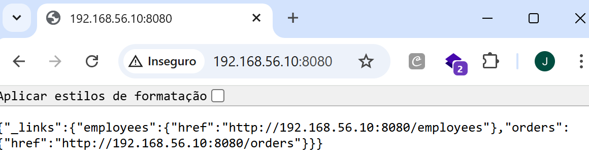
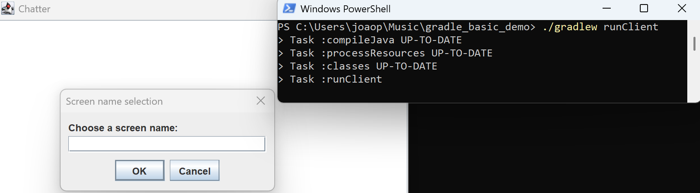
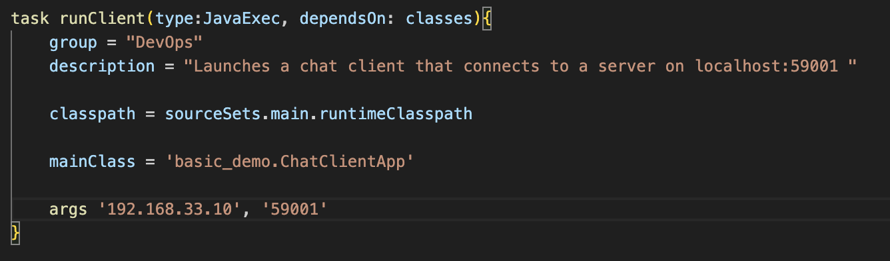
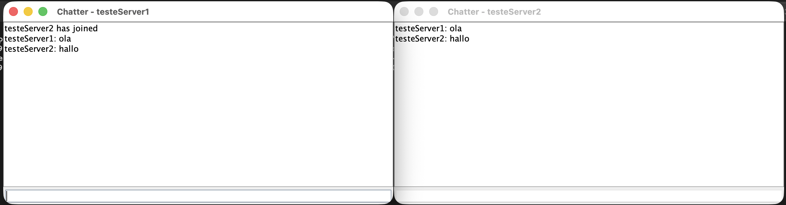

# CA3 — Part 1

In this Class Assignment 3, Vagrant was discussed, which is an open source tool that simplifies the creation and management of virtualized and portable development environments. What we implemented in Class Assignment 2 started to be implemented in this Class Assignment 3, only within the vagrant environment.

### Box initialization in the Part1 folder of CA3 

First, within the local folder of this repository, we created the Part1 folder. Then, vagrant was installed on the host machine, and only later did the following command be executed within the Part1 folder:

```bash
vagrant init bento/ubuntu-22.04
```


### Verify Version and Installation

We run the command to check the vagrant version and make sure that it was installed on the computer.

```bash
vagrant --version
```

The version that appears is 2.4.9 and it's clear that vagrant has actually been installed.


The Vagrantfile was opened in a development environment, and the following configuration script was created to define the virtual machine settings. These include specifying the Vagrant box to be used, setting the hostname of the machine, assigning a private network IP address (192.168.56.10), and forwarding ports to allow access to services such as the REST API (port 8080) and a simple chat application (port 5000).
Additionally, the configuration includes a provisioning script (*provision.sh*) responsible for automatically installing and setting up essential development tools such as Git, JDK, Maven, and Gradle.

```ruby
# -*- mode: ruby -*-
# vi: set ft=ruby :

# All Vagrant configuration is done below. The "2" in Vagrant.configure
# configures the configuration version (we support older styles for
# backwards compatibility). Please don't change it unless you know what
# you're doing.

Vagrant.configure("2") do |config|
  config.vm.box = "bento/ubuntu-22.04"
  config.vm.hostname = "vagrant-machine"
  config.vm.network "forwarded_port", guest: 8080, host: 8080   # for REST API
  config.vm.network "forwarded_port", guest: 5000, host: 5000   # for simple chat
  config.vm.network "private_network", ip: "192.168.56.10"

  # Provision Script
  config.vm.provision "shell", path: "provision.sh"
end
```

The provisioning shell script, where file is *provision.sh*, uses the following initial code:

```bash
#!/usr/bin/env bash
# Update packages
sudo apt-get update -y

# Install git and basic utilities
sudo apt-get install -y git curl unzip

# Install Java (JDK 17)
sudo apt-get install -y openjdk-17-jdk

# Install Maven
sudo apt-get install -y maven

# Install Gradle
sudo apt-get install -y gradle

# Check installations
java -version
mvn -version
gradle -v
git --version
```


After configuring the file demonstrated previously, a command was executed to start the Vagrant virtual machine with the Ubuntu operating system version 22.04 (not 22.08) and the Vagrantfile settings in the virtualization provider called VirtualBox. The command used was:

```bash
vagrant up
```

This command performs several tasks automatically: it creates the virtual machine if it does not already exist, starts it if it is stopped, sets up the network configuration (in this case, a private IP) and executes any provisioning scripts defined in the Vagrantfile. In this example, provisioning installs Git, JDK, Maven, and Gradle, ensuring that the development environment is ready to use immediately. In another situation, if you are using a computer with the macOS operating system, you could use the virtualization provider VMware Fusion or Parallels, which is even advisable, as they offer better performance and tighter integration with the host system. To use these providers, you may need to install the corresponding Vagrant plugin and specify the provider when running the vagrant up command:

After executing the command shown above, the Oracle VirtualBox Machine program is opened, asks in administrator mode if you want to run the Vagrant virtual machine, and only then does the Vagrant machine run automatically and in the terminal where you are working (in this case Powershell is used), all information is processed simultaneously. The following image appears and means that the virtual machine was automatically created in *Oracle VBox Machine*.


Then, the following command was executed to log in to the vagrant machine.

```bash
vagrant ssh
```

And the result of the exit was what was desired, the execution was successful.


On the vagrant machine, we cloned our repository with the command:

```bash
git clone https://github.com/mario-baptista/cogsi2526-1211265-1250525-1250204.git
```

Next, we moved to the Part1 folder within CA3, and git cloned the REST API developed in Spring Boot and the simple chat application in Gradle.

```bash
cd cogsi2526-1211265-1250525-1250204/CA3/Part1
git clone https://github.com/spring-guides/tut-rest
git clone https://github.com/lmpnogueira/gradle_basic_demo
```

To execute the API and run it on the host machine side, we went to the gradle project in links folder and ran the command:

```bash
../mvnw spring-boot:run
```

The result was:

```
vagrant@vagrant-machine:~/cogsi2526-1211265-1250525-1250204/CA3/Part1/tut-rest/links$ ../mvnw spring-boot:run
[INFO] Scanning for projects...
[INFO]
[INFO] ------------------< org.springframework.guides:links >------------------
[INFO] Building links 0.0.1-SNAPSHOT
[INFO]   from pom.xml
[INFO] --------------------------------[ jar ]---------------------------------
[INFO]
[INFO] >>> spring-boot:3.2.5:run (default-cli) > test-compile @ links >>>
[INFO]
[INFO] --- resources:3.3.1:resources (default-resources) @ links ---
[INFO] skip non existing resourceDirectory /home/vagrant/cogsi2526-1211265-1250525-1250204/CA3/Part1/tut-rest/links/src/main/resources
[INFO] skip non existing resourceDirectory /home/vagrant/cogsi2526-1211265-1250525-1250204/CA3/Part1/tut-rest/links/src/main/resources
[INFO]
[INFO] --- compiler:3.11.0:compile (default-compile) @ links ---
[INFO] Nothing to compile - all classes are up to date
[INFO]
[INFO] --- resources:3.3.1:testResources (default-testResources) @ links ---
[INFO] skip non existing resourceDirectory /home/vagrant/cogsi2526-1211265-1250525-1250204/CA3/Part1/tut-rest/links/src/test/resources
[INFO]
[INFO] --- compiler:3.11.0:testCompile (default-testCompile) @ links ---
[INFO] No sources to compile
[INFO]
[INFO] <<< spring-boot:3.2.5:run (default-cli) < test-compile @ links <<<
[INFO]
[INFO]
[INFO] --- spring-boot:3.2.5:run (default-cli) @ links ---
[INFO] Attaching agents: []

  .   ____          _            __ _ _
 /\\ / ___'_ __ _ _(_)_ __  __ _ \ \ \ \
( ( )\___ | '_ | '_| | '_ \/ _` | \ \ \ \
 \\/  ___)| |_)| | | | | || (_| |  ) ) ) )
  '  |____| .__|_| |_|_| |_\__, | / / / /
 =========|_|==============|___/=/_/_/_/
 :: Spring Boot ::                (v3.2.5)

2025-10-30T17:53:33.328Z  INFO 9080 --- [           main] payroll.PayrollApplication               : Starting PayrollApplication using Java 17.0.16 with PID 9080 (/home/vagrant/cogsi2526-1211265-1250525-1250204/CA3/Part1/tut-rest/links/target/classes started by vagrant in /home/vagrant/cogsi2526-1211265-1250525-1250204/CA3/Part1/tut-rest/links)
2025-10-30T17:53:33.348Z  INFO 9080 --- [           main] payroll.PayrollApplication               : No active profile set, falling back to 1 default profile: "default"
2025-10-30T17:53:35.128Z  INFO 9080 --- [           main] .s.d.r.c.RepositoryConfigurationDelegate : Bootstrapping Spring Data JPA repositories in DEFAULT mode.
2025-10-30T17:53:35.274Z  INFO 9080 --- [           main] .s.d.r.c.RepositoryConfigurationDelegate : Finished Spring Data repository scanning in 128 ms. Found 2 JPA repository interfaces.
2025-10-30T17:53:36.449Z  INFO 9080 --- [           main] o.s.b.w.embedded.tomcat.TomcatWebServer  : Tomcat initialized with port 8080 (http)
2025-10-30T17:53:36.478Z  INFO 9080 --- [           main] o.apache.catalina.core.StandardService   : Starting service [Tomcat]
2025-10-30T17:53:36.480Z  INFO 9080 --- [           main] o.apache.catalina.core.StandardEngine    : Starting Servlet engine: [Apache Tomcat/10.1.20]
2025-10-30T17:53:36.604Z  INFO 9080 --- [           main] o.a.c.c.C.[Tomcat].[localhost].[/]       : Initializing Spring embedded WebApplicationContext
2025-10-30T17:53:36.607Z  INFO 9080 --- [           main] w.s.c.ServletWebServerApplicationContext : Root WebApplicationContext: initialization completed in 3010 ms
2025-10-30T17:53:36.894Z  INFO 9080 --- [           main] com.zaxxer.hikari.HikariDataSource       : HikariPool-1 - Starting...
2025-10-30T17:53:37.371Z  INFO 9080 --- [           main] com.zaxxer.hikari.pool.HikariPool        : HikariPool-1 - Added connection conn0: url=jdbc:h2:mem:c71b8e0c-0789-4892-aef8-1d92616e4799 user=SA
2025-10-30T17:53:37.379Z  INFO 9080 --- [           main] com.zaxxer.hikari.HikariDataSource       : HikariPool-1 - Start completed.
2025-10-30T17:53:37.483Z  INFO 9080 --- [           main] o.hibernate.jpa.internal.util.LogHelper  : HHH000204: Processing PersistenceUnitInfo [name: default]
2025-10-30T17:53:37.605Z  INFO 9080 --- [           main] org.hibernate.Version                    : HHH000412: Hibernate ORM core version 6.4.4.Final
2025-10-30T17:53:37.677Z  INFO 9080 --- [           main] o.h.c.internal.RegionFactoryInitiator    : HHH000026: Second-level cache disabled
2025-10-30T17:53:38.159Z  INFO 9080 --- [           main] o.s.o.j.p.SpringPersistenceUnitInfo      : No LoadTimeWeaver setup: ignoring JPA class transformer
2025-10-30T17:53:40.442Z  INFO 9080 --- [           main] o.h.e.t.j.p.i.JtaPlatformInitiator       : HHH000489: No JTA platform available (set 'hibernate.transaction.jta.platform' to enable JTA platform integration)
2025-10-30T17:53:40.551Z  INFO 9080 --- [           main] j.LocalContainerEntityManagerFactoryBean : Initialized JPA EntityManagerFactory for persistence unit 'default'
2025-10-30T17:53:41.243Z  WARN 9080 --- [           main] JpaBaseConfiguration$JpaWebConfiguration : spring.jpa.open-in-view is enabled by default. Therefore, database queries may be performed during view rendering. Explicitly configure spring.jpa.open-in-view to disable this warning
2025-10-30T17:53:42.408Z  INFO 9080 --- [           main] o.s.b.w.embedded.tomcat.TomcatWebServer  : Tomcat started on port 8080 (http) with context path ''
2025-10-30T17:53:42.433Z  INFO 9080 --- [           main] payroll.PayrollApplication               : Started PayrollApplication in 9.99 seconds (process running for 10.928)
2025-10-30T17:53:42.873Z  INFO 9080 --- [           main] payroll.LoadDatabase                     : Preloaded Employee{id=1, firstName='Bilbo', lastName='Baggins', role='burglar'}
2025-10-30T17:53:42.879Z  INFO 9080 --- [           main] payroll.LoadDatabase                     : Preloaded Employee{id=2, firstName='Frodo', lastName='Baggins', role='thief'}
2025-10-30T17:53:42.902Z  INFO 9080 --- [           main] payroll.LoadDatabase                     : Preloaded Order{id=1, description='MacBook Pro', status=COMPLETED}
2025-10-30T17:53:42.903Z  INFO 9080 --- [           main] payroll.LoadDatabase                     : Preloaded Order{id=2, description='iPhone', status=IN_PROGRESS}
^C2025-10-30T17:53:51.120Z  INFO 9080 --- [ionShutdownHook] j.LocalContainerEntityManagerFactoryBean : Closing JPA EntityManagerFactory for persistence unit 'default'
2025-10-30T17:53:51.140Z  INFO 9080 --- [ionShutdownHook] com.zaxxer.hikari.HikariDataSource       : HikariPool-1 - Shutdown initiated...
2025-10-30T17:53:51.152Z  INFO 9080 --- [ionShutdownHook] com.zaxxer.hikari.HikariDataSource       : HikariPool-1 - Shutdown completed.
[INFO] ------------------------------------------------------------------------
[INFO] BUILD SUCCESS
[INFO] ------------------------------------------------------------------------
[INFO] Total time:  23.266 s
[INFO] Finished at: 2025-10-30T17:53:51Z
[INFO] ------------------------------------------------------------------------
```

Subsequently, in a browser of your choice, type the following link into the search engine on the host PC:

```
https://192.168.56.10:8080
```

And, the result of this research that should emerge, must include the following:



On the Vagrant machine, two tasks were added within the gradle project, in the build.gradle file: runServer and runClient. We pass the argument 5000, as it is the port on which the server will listen for connections.

```java
tasks.register('runServer', JavaExec) {
    classpath = sourceSets.main.runtimeClasspath
    mainClass = 'basic_demo.ChatServerApp'
    args '5000'
}

tasks.register('runClient', JavaExec) {
    classpath = sourceSets.main.runtimeClasspath
    mainClass = 'basic_demo.ChatClientApp'
    args '192.168.56.10', '5000'
}
```

Finally, on the server side, the command below was reproduced to run the server:

```bash
./gradlew runServer
```
The result is what happens in the following image:


In PowerShell on Windows (client side), git clone the repository in a random local folder:

```bash
git clone https://github.com/lmpnogueira/gradle_basic_demo
```


Next, we insert the following code into the client-side build.gradle file:

```java
task runClient(type:JavaExec, dependsOn: classes){
    classpath = sourceSets.main.runtimeClasspath
    mainClass = 'basic_demo.ChatClientApp'
    args '192.168.56.10', '5000'
}
```

Later, on the client side, the command was executed to compile gradle (*./gradlew build*) and see if any errors appeared. As nothing came up, the following command was run:

```bash
./gradlew runClient
```

The result was the following: 



As shown in the image above on the left side, a popup appears for the user to enter their name, with the aim of starting the chat conversation later.

In the simple chat application, the name *joaoaraujo* was entered as the screen name, and immediately afterwards, on the vagrant machine, the server gave an alert saying that a user had just entered.


### Automating Cloning, Building, and Starting Applications

To automate the process of cloning repositories, building applications, and starting services, use the `automate_apps.sh` script with environment variables.

1. **Set Environment Variables**: Control which steps run by setting boolean flags (`true` or `false`). Defaults are `false`.
   - `CLONE_REPOS=true`: Clone Spring PetClinic, Payroll (tut-rest), and Gradle Basic Demo repos.
   - `BUILD_APPS=true`: Build the applications using Maven/Gradle.
   - `START_SERVICES=true`: Start services in the background (PetClinic and Payroll on port 8080, Chat Server on port 5000).

2. **Run the Automation Script**:
   - After `vagrant ssh`, navigate to the Part1 folder: `cd cogsi2526-1211265-1250525-1250204/CA3/Part1`
   - Execute with vars: `CLONE_REPOS=true BUILD_APPS=true START_SERVICES=true ./automate_apps.sh`
   - Or integrate into Vagrantfile provisioning (see Vagrantfile updates above).

3. **Verify**:
   - Check processes: `ps aux | grep java` or `ps aux | grep gradle`.
   - Access services: `http://192.168.56.10:8080` for APIs, connect chat client to `192.168.56.10:5000`.
   - Logs: Check terminal output or app logs for errors.

4. **Customization**: Modify `automate_apps.sh` for additional apps or repo URLs. Ensure ports don't conflict.

This automation reduces manual steps, making the Vagrant environment more reproducible.

To test that the applications are running on the server, we changed the build.gradle on `gradle_basic_demo` to use the server IP address instead of `localhost`:





And we can also use the browser to check the REST application:

