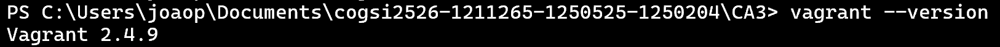
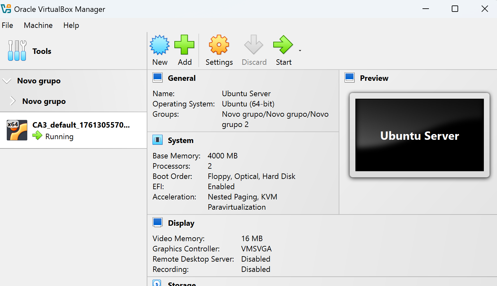

# CA3 — Part 1

In this Class Assignment 3, Vagrant was discussed, which is an open source tool that simplifies the creation and management of virtualized and portable development environments. What we implemented in Class Assignment 2 started to be implemented in this Class Assignment 3, only within the vagrant environment.

### Box initialization in the CA3 folder

First, within the local folder of this repository, we created the CA3 folder. Then, vagrant was installed on the host machine, and only later did the following command be executed within the CA3 folder:

```bash
vagrant init bento/ubuntu-22.04
```


### Verify Version and Installation

We run the command to check the vagrant version and make sure that it was installed on the computer.

```bash
vagrant --version
```

The version that appears is 2.4.9 and it's clear that vagrant has actually been installed.



Now, the Vagrantfile file was opened in a coding environment and the following code was developed with the virtual machine configurations that include the name of the vagrant box, hostname of the machine, insertion of the network IP address and the installation of Git, JDK, Maven and Gradle tools. Basically, we have to tell the virtual machine what to install or even configure automatically and this, very succinctly, is called *provisioning*.

```ruby
# -*- mode: ruby -*-
# vi: set ft=ruby :

# All Vagrant configuration is done below. The "2" in Vagrant.configure
# configures the configuration version (we support older styles for
# backwards compatibility). Please don't change it unless you know what
# you're doing.
Vagrant.configure("2") do |config|
  # The most common configuration options are documented and commented below.
  # For a complete reference, please see the online documentation at
  # https://docs.vagrantup.com.

  # Every Vagrant development environment requires a box. You can search for
  # boxes at https://vagrantcloud.com/search.
  config.vm.box = "bento/ubuntu-22.04"
  config.vm.hostname = "vagrant-machine"

  # Private network to access applications on the host  
  config.vm.network "private_network", ip: "192.168.56.10"

  # Provisioning: install Git, JDK, Maven, Gradle
  config.vm.provision "shell", inline: <<-SHELL
    apt-get update
    apt-get install -y git openjdk-17-jdk maven unzip curl
    # Install Gradle
    wget https://services.gradle.org/distributions/gradle-8.3-bin.zip -P /tmp
    unzip -d /opt/gradle /tmp/gradle-8.3-bin.zip
    echo "export PATH=\$PATH:/opt/gradle/gradle-8.3/bin" >> /etc/profile
  SHELL
end
```

After configuring the file demonstrated previously, a command was executed to start the Vagrant virtual machine with the Ubuntu operating system version 22.04 (not 22.08) and the Vagrantfile settings in the virtualization provider called VirtualBox. The command used was:

```bash
vagrant up
```

This command performs several tasks automatically: it creates the virtual machine if it does not already exist, starts it if it is stopped, sets up the network configuration (in this case, a private IP) and executes any provisioning scripts defined in the Vagrantfile. In this example, provisioning installs Git, JDK, Maven, and Gradle, ensuring that the development environment is ready to use immediately. In another situation, if you are using a computer with the macOS operating system, you could use the virtualization provider VMware Fusion or Parallels, which is even advisable, as they offer better performance and tighter integration with the host system. To use these providers, you may need to install the corresponding Vagrant plugin and specify the provider when running the vagrant up command:

After executing the command shown above, the Oracle VirtualBox Machine program is opened, asks in administrator mode if you want to run the Vagrant virtual machine, and only then does the Vagrant machine run automatically and in the terminal where you are working (in this case Powershell is used), all information is processed simultaneously. The following image appears and means that the virtual machine was automatically created in *Oracle VBox Machine*.



Then, the following command was executed to log in to the vagrant machine.

```bash
vagrant ssh
```

And the result of the exit was what was desired, the execution was successful.


