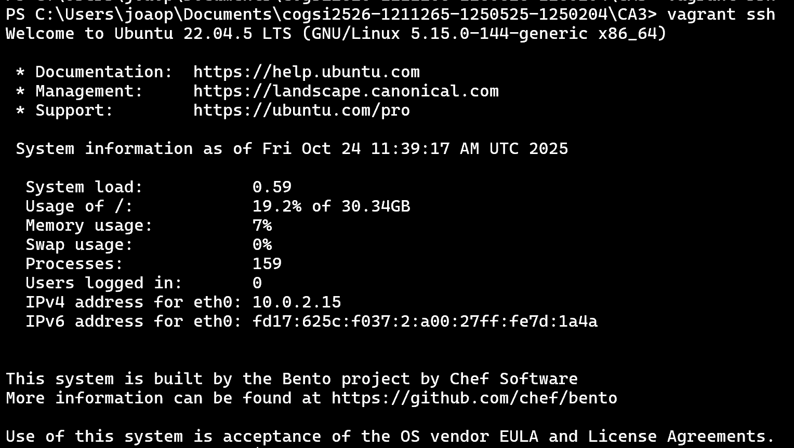

# CA3 — Part 1

In this Class Assignment 3, Vagrant was discussed, which is an open source tool that simplifies the creation and management of virtualized and portable development environments. What we implemented in Class Assignment 2 started to be implemented in this Class Assignment 3, only within the vagrant environment.

### Box initialization in the Part1 folder of CA3 

First, within the local folder of this repository, we created the Part1 folder. Then, vagrant was installed on the host machine, and only later did the following command be executed within the Part1 folder:

```bash
vagrant init bento/ubuntu-22.04
```


### Verify Version and Installation

We run the command to check the vagrant version and make sure that it was installed on the computer.

```bash
vagrant --version
```

The version that appears is 2.4.9 and it's clear that vagrant has actually been installed.


The Vagrantfile was opened in a development environment, and the following configuration script was created to define the virtual machine settings. These include specifying the Vagrant box to be used, setting the hostname of the machine, assigning a private network IP address, and forwarding ports to allow access to services such as the REST API (port 8080) and a simple chat application (port 5000).
Additionally, the configuration includes a provisioning script (*provision.sh*) responsible for automatically installing and setting up essential development tools such as Git, JDK, Maven, and Gradle.

```ruby
# -*- mode: ruby -*-
# vi: set ft=ruby :

# All Vagrant configuration is done below. The "2" in Vagrant.configure
# configures the configuration version (we support older styles for
# backwards compatibility). Please don't change it unless you know what
# you're doing.

Vagrant.configure("2") do |config|
  config.vm.box = "bento/ubuntu-22.04"
  config.vm.hostname = "vagrant-machine"
  config.vm.network "forwarded_port", guest: 8080, host: 8080   # for REST API
  config.vm.network "forwarded_port", guest: 5000, host: 5000   # for simple chat
  config.vm.network "private_network", ip: "192.168.56.10"

  # Provision Script
  config.vm.provision "shell", path: "provision.sh"
end
```

The provisioning shell script, where file is *provision.sh*, uses the following initial code:

```bash
#!/usr/bin/env bash
# Update packages
sudo apt-get update -y

# Install git and basic utilities
sudo apt-get install -y git curl unzip

# Install Java (JDK 17)
sudo apt-get install -y openjdk-17-jdk

# Install Maven
sudo apt-get install -y maven

# Install Gradle
sudo apt-get install -y gradle

# Check installations
java -version
mvn -version
gradle -v
git --version
```


After configuring the file demonstrated previously, a command was executed to start the Vagrant virtual machine with the Ubuntu operating system version 22.04 (not 22.08) and the Vagrantfile settings in the virtualization provider called VirtualBox. The command used was:

```bash
vagrant up
```

This command performs several tasks automatically: it creates the virtual machine if it does not already exist, starts it if it is stopped, sets up the network configuration (in this case, a private IP) and executes any provisioning scripts defined in the Vagrantfile. In this example, provisioning installs Git, JDK, Maven, and Gradle, ensuring that the development environment is ready to use immediately. In another situation, if you are using a computer with the macOS operating system, you could use the virtualization provider VMware Fusion or Parallels, which is even advisable, as they offer better performance and tighter integration with the host system. To use these providers, you may need to install the corresponding Vagrant plugin and specify the provider when running the vagrant up command:

After executing the command shown above, the Oracle VirtualBox Machine program is opened, asks in administrator mode if you want to run the Vagrant virtual machine, and only then does the Vagrant machine run automatically and in the terminal where you are working (in this case Powershell is used), all information is processed simultaneously. The following image appears and means that the virtual machine was automatically created in *Oracle VBox Machine*.


Then, the following command was executed to log in to the vagrant machine.

```bash
vagrant ssh
```

And the result of the exit was what was desired, the execution was successful.



On the vagrant machine, we cloned our repository with the command:

```bash
git clone https://github.com/mario-baptista/cogsi2526-1211265-1250525-1250204.git
```

Next, we moved to the Part1 folder within CA3, and git cloned the REST API developed in Spring Boot and the simple chat application in Gradle.

```bash
cd cogsi2526-1211265-1250525-1250204/CA3/Part1
git clone https://github.com/spring-guides/tut-rest
git clone https://github.com/lmpnogueira/gradle_basic_demo
```
