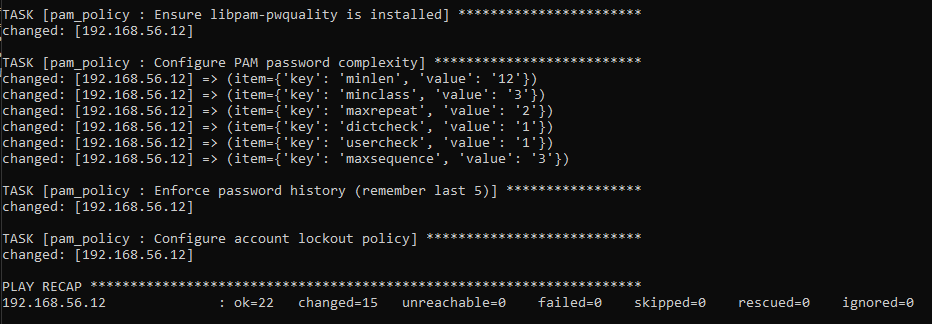
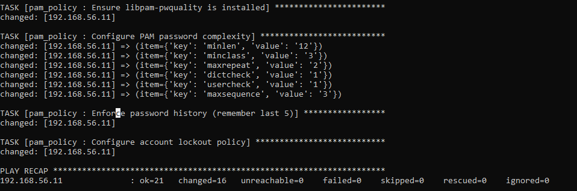
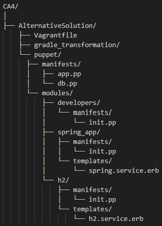
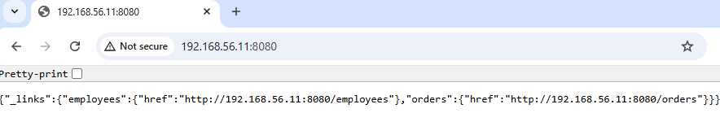
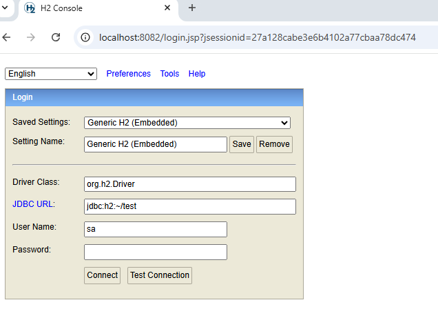

CA4 - README.md with Part1 and Alternative Solution


CA4 — Part 1


We basically took the setup from CA3 Part 2 and improved it using Ansible.  
Now, instead of manually installing things inside the VMs, we used Vagrant to set up the VMs and Ansible (local provisioner) to configure and run the services.
The goal was to make everything: Automated, repeatable (idempotent), resilient to small failures (using ignore\_errors, failed\_when, retries, and until)

1. Project Structure (Important Files)


2. Vagrantfile Configuration

Each VM runs ansible\_local and is assigned a role through site.yml.


3. Ansible Inventory (Which VM is Which)

Both roles run locally within each VM:


4. site.yml (Role Assignment)

This file tells Ansible which role goes to which VM:


5. Role: Spring Application (spring\_app)

File: ansible/roles/spring\_app/tasks/main.yml
This:

-Installs Java, Git, Gradle

-Copies the Spring source code into /opt/gradle\_transformation

-Configures connection to H2

-Builds the app using Gradle

-Creates and starts a Systemd service


6.Error Handling Used Here

We used:

-(ignore_errors:true): For file sync issues

-retries/until: For Gradle sometimes failing

-failed_when: To detect failed builds more accurately


7. H2 Database (h2)

File: ansible/roles/h2/tasks/main.yml
This :
-Installs Java and UFW firewall

-Downloads the H2 server JAR

-Configures firewall access for port 9092

-Sets up H2 as a Systemd service


Systemd Service Template


8. Running the Automation

First Provision Run:


Second Run (idempotency confirmed):


9. H2 Database Verification

H2 Running as Service:


Web Login:


Database Tables:


10. Spring Application Working
    
Employees:


Orders:


Adding Frodo to employees:


### PAM Configuration 

To perform the PAM configuration, first in the *site.yml* file we add the following code:

```yml
- name: Configure PAM policy for all hosts
  hosts: all
  become: true
  roles:
    - pam_policy
```

Secondly, in the */ansible/roles* folder we create the *pam_policy* folder and within it the *tasks* folder. Within tasks, we develop the *main.yml* file that contains the following code:

```yml
---
- name: Ensure libpam-pwquality is installed
  apt:
    name: libpam-pwquality
    state: present
    update_cache: true

- name: Configure PAM password complexity
  lineinfile:
    path: /etc/security/pwquality.conf
    regexp: '^{{ item.key }}='
    line: "{{ item.key }}={{ item.value }}"
    create: yes
  loop:
    - { key: 'minlen', value: '12' }
    - { key: 'minclass', value: '3' }
    - { key: 'maxrepeat', value: '2' }
    - { key: 'dictcheck', value: '1' }
    - { key: 'usercheck', value: '1' }
    - { key: 'maxsequence', value: '3' }

- name: Enforce password history (remember last 5)
  lineinfile:
    path: /etc/pam.d/common-password
    regexp: '^password\s+required\s+pam_unix.so'
    line: 'password required pam_unix.so remember=5 use_authtok sha512'

- name: Configure account lockout policy
  blockinfile:
    path: /etc/pam.d/common-auth
    insertafter: 'pam_unix.so'
    block: |
      auth required pam_tally2.so deny=5 unlock_time=600 onerr=fail audit even_deny_root_account silent
```

After that, use the *vagrant up* command to upload both machines.
The PAM result (about H2 database VM) from the provisioning part from Ansible was as follows:




The PAM result (about APP Spring VM) from the provisioning part from Ansible was as follows:



Later, the *vagrant ssh app* command was written to access the app machine. On the app's machine, a test was carried out to change the password of the application's virtual machine. Password 1234 was entered and gave the following error:

 ```bash
  vagrant@app-vm:~$ sudo passwd vagrant
  New password:
  BAD PASSWORD: The password is shorter than 12 characters
  Retype new password:
 ```

In this case below, the password *mariobatistanajoaoaraujo1* was typed and gave the following error:

```bash
vagrant@app-vm:~$ sudo passwd vagrant
New password:
BAD PASSWORD: The password contains less than 3 character classes
Retype new password:
 ```

The two errors above are normal and comply with what is required to be carried out in this work: the password policy dictates that there must be three of the four-character classes: uppercase letters, lowercase letters, digits, and symbols.

## Groups and Users

In this part, we enhanced the setup with user and group management.

1. Developers Group and User

Using Ansible, we created a new role called "developers" to manage user and group creation across all VMs.

**New Files Added:**
- `ansible/roles/developers/tasks/main.yml`: Contains tasks to create the group and user.

**Tasks in `ansible/roles/developers/tasks/main.yml`:**
- Create the "developers" group using the `group` module.
- Create the "devuser" user, assigning it to the "developers" group, with a home directory and bash shell.

**Updated Files:**
- `ansible/site.yml`: Added a new play to run the "developers" role on all hosts before the application and database roles.

This ensures the group and user exist before setting directory ownerships.

**Code for `ansible/roles/developers/tasks/main.yml`:**
```yaml
- name: Create developers group
  group:
    name: developers
    state: present

- name: Create devuser
  user:
    name: devuser
    group: developers
    groups: developers
    state: present
    shell: /bin/bash
    create_home: yes
```

**Updated `ansible/site.yml`:**
```yaml
- name: Setup developers group and user on all hosts
  hosts: all
  become: true
  roles:
    - developers
```

## Directory Permissions

- On host1 (app VM): The Spring application directory `/opt/gradle_transformation` is owned by `devuser:developers` with permissions 770, restricting access to members of the developers group.
- On host2 (db VM): The H2 database directory `/opt/h2` is owned by `devuser:developers` with permissions 770.

**Updated `ansible/roles/spring_app/tasks/main.yml` (added ownership task):**
```yaml
- name: Set ownership of app directory
  file:
    path: /opt/gradle_transformation
    owner: devuser
    group: developers
    mode: '770'
    recurse: yes
```

**Updated `ansible/roles/h2/tasks/main.yml` (added ownership task):**
```yaml
- name: Set ownership of h2 directory
  file:
    path: /opt/h2
    owner: devuser
    group: developers
    mode: '770'
    recurse: yes
```

- Group: developers
- User: devuser (member of developers group)


## Health Checks

We added health-check tasks to verify that services are running correctly after deployment.

- On host1: Use the `uri` module to send a GET request to `http://localhost:8080/` and confirm a 200 status code.
- On host2: Use the `wait_for` module to check that port 9092 is open and accepting connections.

**Updated `ansible/roles/spring_app/tasks/main.yml` (added health check):**
```yaml
- name: Health check for Spring app
  uri:
    url: http://localhost:8080/
    method: GET
  register: health_check
  failed_when: health_check.status != 200
  retries: 5
  delay: 3
```


**Updated `ansible/roles/h2/tasks/main.yml` (added health check):**
```yaml
- name: Health check for H2 port
  wait_for:
    port: 9092
    timeout: 30
```


## Alternative Solution — Puppet


As an alternative to Ansible, we can use Puppet, another powerful Configuration Management Tool.
While Ansible is agentless (uses SSH to connect and execute playbooks), Puppet uses a master-agent architecture, where each managed node (VM) runs a Puppet agent that connects to a Puppet master to fetch and apply configurations written in manifests (using Puppet DSL).

Our goal is to replicate the same automation pipeline as in the Ansible solution — fully automated provisioning of:

- VMs using Vagrant;
- H2 Database Service;
- Spring Boot Application;
- User and Group management;
- Health checks and permissions.

### How Puppet Compares to Ansible

| **Feature**              | **Ansible**                                                 | **Puppet**                                                       |
|---------------------------|-------------------------------------------------------------|------------------------------------------------------------------|
| **Architecture**          | Agentless (runs over SSH or local)                          | Agent-based (requires master and agent setup)                    |
| **Language**              | YAML (Declarative Playbooks)                                | Puppet DSL (Ruby-like Declarative Syntax)                        |
| **Execution Model**       | Push (controller pushes configuration to hosts)             | Pull (agents periodically fetch configuration from master)       |
| **Idempotency**           | Yes, via module design                                      | Yes, native in its model                                         |
| **Ease of Use**           | Easier to set up for small environments                     | Better for large infrastructures with frequent syncs             |
| **Error Handling**        | Manual (ignore_errors, retries, etc.)                       | Automatic, with detailed reporting through PuppetDB              |
| **Extensibility**         | Simple roles and modules                                   | Complex module ecosystem (Forge)                                 |
| **Best For**              | Ad-hoc provisioning, testing labs                           | Persistent configuration management across many servers          |


### Puppet Architecture

Puppet can work in two ways:

- Master/Agent mode – a central server (Puppet Master) manages several nodes (Agents) that apply the configurations.

- Local Mode (Apply) – each machine applies its own settings without depending on a Master.

In our case (without complex infrastructure), we use local mode, integrated into Vagrant through the “puppet” provisioner.
Thus, each VM applies its .pp file automatically when it is created.

### Project Structure

The project structure in Puppet is similar to that in Ansible (roles → modules):




### Implementation of Puppet Solution

First we create the *AlternativeSolution* folder inside the *CA4* folder.

```bash
mkdir AlternativeSolution
```

Then we execute the command inside the *AlternativeSolution* folder:
```bash
vagrant init bento/ubuntu-22.04
```

Therefore, in the generated Vagrantfile file, we develop the following code:

```ruby
Vagrant.configure("2") do |config|
  config.vm.boot_timeout = 600

  # === Ensure SSH keys exist ===
  require 'fileutils'
  ssh_dir = File.expand_path("~/.ssh")
  private_key = File.join(ssh_dir, "id_rsa_vagrant")
  public_key  = "#{private_key}.pub"

  FileUtils.mkdir_p(ssh_dir)

  unless File.exist?(private_key) && File.exist?(public_key)
    puts "==> SSH key pair not found. Generating new keys at #{private_key}..."
    system("ssh-keygen -t rsa -b 4096 -f \"#{private_key}\" -N \"\"")
  end
  config.ssh.insert_key = true

    # DB VM
  config.vm.define "db" do |db|
    db.vm.box = "bento/ubuntu-22.04"
    db.vm.hostname = "db-vm"
    db.vm.network "private_network", ip: "192.168.56.12"
    db.vm.network "forwarded_port", guest: 8082, host: 8082
    db.vm.synced_folder "./h2-data", "/vagrant/h2-data", create: true

    db.vm.provision "shell", inline: <<-SHELL
      sudo apt-get update -y
      sudo apt-get install -y puppet
    SHELL

    db.vm.provision "puppet" do |puppet|
      puppet.manifests_path = "puppet/manifests"
      puppet.manifest_file  = "db.pp"
      puppet.module_path    = "puppet/modules"
    end
  end

  # APP VM
  config.vm.define "app" do |app|
    app.vm.box = "bento/ubuntu-22.04"
    app.vm.hostname = "app-vm"
    app.vm.network "private_network", ip: "192.168.56.11"
    app.vm.network "forwarded_port", guest: 8080, host: 8080

    app.vm.provision "shell", inline: <<-SHELL
      sudo apt-get update -y
      sudo apt-get install -y puppet
    SHELL

    app.vm.provision "puppet" do |puppet|
      puppet.manifests_path = "puppet/manifests"
      puppet.manifest_file  = "app.pp"
      puppet.module_path    = "puppet/modules"
    end
  end
end
```

Then (in this case using the PowerShell command line, which was developed as an alternative work solution), the project structure was created manually, which was already demonstrated above. The commands used to create the folders were:

```bash
New-Item -ItemType Directory -Path puppet\manifests -Force
New-Item -ItemType Directory -Path puppet\modules\developers\manifests -Force
New-Item -ItemType Directory -Path puppet\modules\spring_app\manifests -Force
New-Item -ItemType Directory -Path puppet\modules\spring_app\templates -Force
New-Item -ItemType Directory -Path puppet\modules\h2\manifests -Force
New-Item -ItemType Directory -Path puppet\modules\h2\templates -Force
```

This set of PowerShell commands manually creates the Puppet project directory structure. Each module (developers, spring_app, h2) receives its own manifests and templates folders, while the main manifests folder will be used for global configuration files. The -Force parameter ensures that directories are created even if they already partially exist.


Then, with the folders created, we create the files. After creating the folders, .pp files were created for class and node definitions, and .erb files for systemd service templates. These files start empty and will be filled with the configuration of modules and services.

```bash
New-Item -ItemType File -Path puppet\manifests\app.pp -Force
New-Item -ItemType File -Path puppet\manifests\db.pp -Force
New-Item -ItemType File -Path puppet\modules\developers\manifests\init.pp -Force
New-Item -ItemType File -Path puppet\modules\spring_app\manifests\init.pp -Force
New-Item -ItemType File -Path puppet\modules\h2\manifests\init.pp -Force
New-Item -ItemType File -Path puppet\modules\spring_app\templates\spring.service.erb -Force
New-Item -ItemType File -Path puppet\modules\h2\templates\h2.service.erb -Force
```

This code below sets the default Puppet node to include the developers and spring_app modules. This ensures that, when applying the configurations, both the users/developers and the Spring Boot application are configured on the system.

```bash
node default {
  include developers
  include spring_app
}
```

Similar to the previous block, this standard node includes the developer and h2 modules, configuring users and the H2 database in the same node.

```bash
node default {
  include developers
  include h2
}
```


Each service is represented by a Puppet module, similar to Ansible roles. Este módulo cria o grupo developers e o usuário devuser associado a esse grupo. The managehome => true option ensures that the home folder is created and configured automatically, and shell => '/bin/bash' sets the user's default interpreter.  The spring_app module performs several tasks:

- Install the openjdk-21-jdk package.
- Create the /opt/spring-app folder and set permissions.
- Copy the application's .jar file to /opt/spring-app.
- Creates the systemd service file using the spring.service.erb template.
- Runs systemd reload when the service changes.
- Ensures that the spring service is running and enabled at boot.

The code developed for these areas was as follows:

```bash
class developers {
  group { 'developers':
    ensure => present,
  }

  user { 'devuser':
    ensure     => present,
    gid        => 'developers',
    home       => '/home/devuser',
    shell      => '/bin/bash',
    managehome => true,
  }
}
```

The h2 module installs openjdk-21-jdk, creates the /opt/h2 directory, downloads the .jar from the H2 Database, configures the systemd service through the h2.service.erb template and ensures that the h2 service is running and enabled to start at boot.


```bash
class spring_app {
    package { 'openjdk-21-jdk':
    ensure => installed,
    }

  file { '/opt/spring-app':
    ensure => directory,
    owner  => 'developer',
    group  => 'developer',
    mode   => '0755',
  }

  file { '/opt/spring-app/app.jar':
    ensure => file,
    source => '/vagrant/gradle_transformation/build/libs/GradleProject_Transformation.jar',
    owner  => 'developer',
    group  => 'developer',
    mode   => '0755',
    require => File['/opt/spring-app'],
  }

  file { '/etc/systemd/system/spring.service':
    ensure  => file,
    content => template('spring_app/spring.service.erb'),
    mode    => '0644',
  }

  exec { 'reload-systemd':
    command => '/bin/systemctl daemon-reload',
    refreshonly => true,
    subscribe => File['/etc/systemd/system/spring.service'],
  }

    service { 'spring':
    ensure => running,
    enable => true,
    require => [Package['openjdk-21-jdk'], File['/opt/spring-app/app.jar']],
    }
}
```

The h2 module installs openjdk-17-jdk, creates the /opt/h2 directory, downloads the .jar from the H2 Database, configures the systemd service through the h2.service.erb template and ensures that the h2 service is running and enabled to start at boot.

```bash
class h2 {
    package { 'openjdk-17-jdk':
    ensure => installed,
}

file { '/opt/h2':
    ensure => directory,
    owner  => 'developer',
    group  => 'developer',
    mode   => '0755',
}

exec { 'download-h2':
    command => '/usr/bin/wget -O /opt/h2/h2.jar https://repo1.maven.org/maven2/com/h2database/h2/2.2.224/h2-2.2.224.jar',
    creates => '/opt/h2/h2.jar',
    path    => ['/usr/bin', '/bin'],
    require => Package['openjdk-17-jdk'],
}

file { '/etc/systemd/system/h2.service':
    ensure  => file,
    content => template('h2/h2.service.erb'),
    mode    => '0644',
}

service { 'h2':
    ensure => running,
    enable => true,
    require => [Exec['download-h2'], File['/etc/systemd/system/h2.service']],
}
}
```

This code below defines the systemd service for the Spring Boot application where it first runs the .jar with the developer user, then automatically restarts in case of failure and is configured to start together with the system (multi-user.target).

```bash
[Unit]
Description=Spring Boot Application
After=network.target

[Service]
User=developer
ExecStart=/usr/bin/java -jar /opt/spring-app/app.jar
SuccessExitStatus=143
Restart=always
RestartSec=5

[Install]
WantedBy=multi-user.target
```

This code below defines the systemd service for the H2 Database VM where it first runs the .jar with the developer user, then automatically restarts in case of failure and allows TCP and Web access from other hosts.

```bash
[Unit]
Description=H2 Database Server
After=network.target

[Service]
User=developer
ExecStart=/usr/bin/java -cp /opt/h2/h2.jar org.h2.tools.Server -tcp -tcpAllowOthers -web -webAllowOthers -ifNotExists
SuccessExitStatus=143
Restart=always
RestartSec=5

[Install]
WantedBy=multi-user.target
```

With the virtual machines running, on the host machine, when you type *192.168.56.11:8080* in the browser, the following content appears:



And, on the host machine, when you type *localhost:8082* in the browser, the following content appears:

