# CA5 - Docker

This assignment involves two Gradle-based projects:

- **gradle_basic_demo**: A simple chat server application built with Gradle, demonstrating basic Java application containerization.
- **gradle_transformation**: A Spring Boot web application that was originally a Maven project, transformed to use Gradle build system. It provides web services on port 8080.


## Part 1: Create two versions of solution and a Multi-Stage Environment

In this first part of the work, different approaches to building and executing the application were implemented, with the aim of comparing the impact of build strategies on image size, layer structure, and runtime efficiency. Two distinct versions of the server were created — one where the entire compilation process takes place within Docker (Version 1) and another where the JAR is pre-compiled on the host and simply copied into the image (Version 2). Both projects implement two Docker containerization strategies to compare build approaches.


In addition, a third approach was developed using multi-stage builds, which explicitly separates the compilation phase from the execution phase, allowing for the creation of lighter images optimised for production.

The analysis also included the use of the docker history command to observe how build choices influence the layers and final size of the images, as well as real-time monitoring of the resources consumed by the containers (CPU, memory, network, and I/O) in order to evaluate the behaviour of the different versions during execution.

### ChatApp Version 1:
- **Approach**: Clone the repository and compile the application directly within the Docker container.

```dockerfile
FROM eclipse-temurin:17

RUN apt-get update && apt-get install -y git

RUN git clone https://github.com/mario-baptista/cogsi2526-1211265-1250525-1250204.git /app

WORKDIR /app/CA2/Part1/gradle_basic_demo

RUN chmod +x ./gradlew

RUN ./gradlew jar

EXPOSE 59001

CMD ["java", "-cp", "build/libs/basic_demo-0.1.0.jar", "basic_demo.ChatServerApp", "59001"]
```
### Line-by-Line Breakdown:
- FROM eclipse-temurin:17: Starts with a full JDK 17 image needed for compilation
- RUN apt-get update && apt-get install -y git: Installs Git to clone repository
- RUN git clone...: Downloads entire source history and code into /app
- WORKDIR...: Sets working directory to the project folder
- RUN chmod +x ./gradlew: Makes Gradle wrapper executable
- RUN ./gradlew jar: Downloads Gradle, all dependencies, compiles code, and creates JAR
- EXPOSE 59001: Documentation-only port declaration (It informs users and other containers which ports the application inside the container is intended to use, it doesnt export the port).
- CMD...: Runs the chat server

### ChatApp Version 2:
- **Approach**: Build the application on the host machine and copy the resulting JAR file into the Docker image.


```dockerfile
FROM eclipse-temurin:17

COPY basic_demo-0.1.0.jar /app/app.jar

WORKDIR /app

EXPOSE 59001

CMD ["java", "-cp", "app.jar", "basic_demo.ChatServerApp", "59001"]
```
### Line-by-Line Breakdown:
- FROM eclipse-temurin:17: Uses JDK image
- COPY...: File copy from host build context into container
- WORKDIR /app: Sets working directory
- EXPOSE 59001: Port declaration
- CMD...: Runs the pre-built JAR

### Spring Application Version 1: 

- **Approach**: Clone the repository and compile the application directly within the Docker container.
```dockerfile
FROM eclipse-temurin:17

RUN apt-get update && apt-get install -y git

RUN git clone https://github.com/mario-baptista/cogsi2526-1211265-1250525-1250204.git /app

WORKDIR /app/CA2/Part2/GradleProject_Transformation

RUN chmod +x ./gradlew

RUN ./gradlew bootJar

EXPOSE 8080

CMD ["java", "-jar", "build/libs/GradleProject_Transformation.jar"]
```

### Explanation of each instruction:

- FROM eclipse-temurin:17: Starts with a full JDK 17 image needed for compilation
- RUN apt-get update && apt-get install -y git: Installs Git to clone repository
- RUN git clone...: Downloads entire source history and code into /app
- WORKDIR...: Sets working directory to the project folder
- RUN chmod +x ./gradlew: Makes Gradle wrapper executable
- RUN ./gradlew jar: Downloads Gradle, all dependencies, compiles code, and creates JAR
- EXPOSE 8080: Documentation-only port declaration.
- CMD...: Runs the spring application


### Spring Application Version 2:
- **Approach**: Build the application on the host machine and copy the resulting JAR file into the Docker image.


```dockerfile
FROM eclipse-temurin:17

COPY GradleProject_Transformation.jar /app/app.jar

WORKDIR /app

EXPOSE 8080

CMD ["java", "-jar", "app.jar"]
```
### Explanation of each instruction:

- FROM eclipse-temurin:17: Uses JDK image
- COPY...: File copy from host build context into container
- WORKDIR /app: Sets working directory
- EXPOSE 8080: Port declaration
- CMD...: Runs the pre-built JAR


### Build

```bash
docker build -t gradle_basic_demo_v1 .
docker build -t gradle_transformation_v1 .
docker build -t gradle_transformation_v2 .
docker build -t gradle_basic_demo_v2 .
```

### Run

```bash
docker run -d -p 59001:59001 --name basic_demo_v1 gradle_basic_demo_v1
docker run -d -p 59002:59001 --name basic_demo_v2 gradle_basic_demo_v2
docker run -d -p 8080:8080 --name transformation_v1 gradle_transformation_v1
docker run -d -p 8081:8080 --name transformation_v2 gradle_transformation_v2
```

### Port Mapping:
- Chat apps: 59001→59001 (v1) and 59002→59001 (v2)
- Spring apps: 8080→8080 (v1) and 8081→8080 (v2)


## Docker History Analysis

Using `docker history <image>` to inspect layer composition:

 


### Image Size Comparison
- **Version 1**: Typically larger due to inclusion of:
  - Git
  - Gradle wrapper and dependencies
  - Source code and intermediate build artifacts
  - Full JDK for compilation
- **Version 2**: Smaller and more efficient:
  - Only contains the runtime JRE
  - Single JAR file
  - Minimal base image layers

### Layer Composition Differences
- **Version 1** shows multiple layers for cloning, dependency resolution, and compilation steps.
- **Version 2** has fewer layers, primarily focused on copying the JAR and setting up the runtime.

### Performance Implications
- Version 1: Slower builds but consistent environments.
- Version 2: Faster image creation and smaller distribution size.

Both approaches were implemented for both demo projects to compare the methodologies in practice.

**Key Differences**: Version 1 Dockerfiles include the full source and build process, resulting in larger images with build dependencies. Version 2 Dockerfiles are simpler, copying only the final JAR, leading to smaller, faster images.

| Version | Characteristics                                                 | Size Implication          |
| ------- | --------------------------------------------------------------- | ------------------------- |
| 1       | Full source, Gradle wrapper, Git, dependencies, build artifacts | Larger images             |
| 2       | Only runtime + JAR                                              | Smaller, efficient images |

## Docker Multi-Stage Build & Comparison with Version V1

Traditionally in v1, Docker contains all the tools needed to build and run the application, for example:

- Git
-Gradle
- Complete source code
- Cache and build artifacts

This results in very large (>1 GB) and less secure images. With multi-stage build, we create two images within the same Dockerfile. There are two stages: the build stage, which contains heavy tools such as git, gradle and certain source code from one or more projects and there is also the runtime stage, that is, a stage that only contains the final .jar file + JRE. Therefore, the final image is much smaller, and the fact is that nothing from the build goes into production.


The Dockerfile file looks like this:

```bash
#-------------- Step 1: Build---------------------------#
FROM eclipse-temurin:17 AS builder

RUN apt-get update && apt-get install -y git
RUN git clone https://github.com/mario-baptista/cogsi2526-1211265-1250525-1250204.git /app

WORKDIR /app/CA2/Part1/gradle_basic_demo

RUN chmod +x ./gradlew
RUN ./gradlew jar


#-------------------- Step 2: Runtime----------------------#

FROM eclipse-temurin:17-jre

WORKDIR /app
COPY --from=builder /app/CA2/Part1/gradle_basic_demo/build/libs/basic_demo-0.1.0.jar /app/app.jar
EXPOSE 59001

CMD ["java", "-cp", "app.jar", "basic_demo.ChatServerApp", "59001"]
```


As already mentioned, there are two stage phases. In this first phase, the *FROM eclipse-temurin:17 AS builder* command chooses the base image with JDK 17 and the AS builder gives this stage a name and is then used in *COPY --from=builder*. 
Then apt is updated and git is installed. Next, the repository of this course unit is cloned to /app within the container. 
Subsequently, using the *WORKDIR* command, docker runs the command to enter the folder where the gradle project designated by *gradle_basic_demo* is located. From this folder, all *RUN* are executed in this folder.

The last two commands in the stage build phase, the first gives *gradlew* execution permission, and finally, when running *./gradlew jar* the file *basic_demo-0.1.0.jar* is generated within the *libs* folder in the path */app/CA2/Part1/gradle_basic_demo/build/libs/*.

In the runtime phase, you start with a new image based only on JRE 17 (runtime, lighter than the JDK) and everything that was installed in the builder (i.e.: git, gradle, code) does not go here. Then, the folder was defined as a working folder within the final image. Subsequently, only the build stage JAR is copied. The code instruction *--from=builder* copies files from the first stage image.


Basically, we copied the .jar file generated by gradle and which is in */app/CA2/Part1/gradle_basic_demo/build/libs/* to the working folder designed */app* with the file generated/copied to that folder called *app.jar*. Therefore, we get what we want: only the JAR is included in the final image and nothing related to Gradle, Git or even the source code. Finally, the last two commands indicate that the application uses port 59001 (the chat server) and finally, the app starts and the command has the following meaning:

- java -cp app.jar: sets the classpath for the app.jar.
- basic_demo.ChatServerApp: application main class.
- "59001": argument passed to the program (server port).

The same realization logic was applied to the *gradle_transformation* project. Note that the port changes to 8080, as this is a service (REST API) that is accessed on the web. The dockerfile code is as follows:

```bash
FROM eclipse-temurin:17 AS builder
RUN apt-get update && apt-get install -y git

RUN git clone https://github.com/mario-baptista/cogsi2526-1211265-1250525-1250204.git /app

WORKDIR /app/CA2/Part2/GradleProject_Transformation

RUN chmod +x ./gradlew

RUN ./gradlew bootJar

CMD ["java", "-jar", "build/libs/GradleProject_Transformation.jar"]


FROM eclipse-temurin:17

COPY --from=builder /app/CA2/Part2/GradleProject_Transformation/build/libs/GradleProject_Transformation.jar /app/app.jar

WORKDIR /app

EXPOSE 8080

CMD ["java", "-jar", "app.jar"]
```
## Building Images

In the terminal, inside the CA5 folder, we execute:

```bash
docker build -t gradle_basic_demo:v1 -f gradle_basic_demo/v1/Dockerfile gradle_basic_demo/v1

docker build -t gradle_basic_demo:multi-stage -f multi_stage/gradle_basic_demo/Dockerfile multi_stage/gradle_basic_demo
```

The first command creates the image of version 1 (v1) of the gradle_basic_demo application, using a traditional Dockerfile located within the gradle_basic_demo/v1 folder.
This image includes the entire build environment within it (Gradle, Git, source code, dependencies), resulting in a larger and less optimized image. 

The second command creates the optimized image with multi-stage build, using a separate Dockerfile within multi_stage/gradle_basic_demo.
In this approach, the build occurs in a first stage, but only the final JAR file is included in the final image, removing unnecessary tools and code.

After compiling the two images, we run the **docker images** command, which immediately allows you to see the size/weight of the two images:

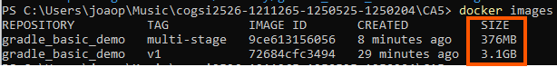

The difference in size between the two images is due to what each one carries internally:

| Image | Size | Reason |
| ------------------------------- | --------- | ------------------------------------------------------------------------------------------------------------------------------- |
| `gradle_basic_demo:v1` | **3.1GB** | Contains *entire development environment*: Git, Gradle, dependencies, cache, source code, build tools, full JDK |
| `gradle_basic_demo:multi-stage` | **376MB** | Contains **only the final JAR + JRE needed to run the application**, eliminating build tools and artifacts |

To conclude:
- The v1 image is huge because it includes everything that was used to compile the application.
- The multi-stage image is small because it only includes what is necessary to run the application.

## Monitor containers resource usage in real time


Before analyzing resource consumption with docker stats, it is necessary to get both containers running. The commands used are:

```bash
docker run -d --name multi-stage -p 59006:59001 gradle_basic_demo:multi-stage

docker run -d --name gradledemo_v1 -p 59005:59001 gradle_basic_demo:v1
```

Each part of these commands has a specific function:

1. docker run -d: Runs the container in detached mode (in the background), allowing it to continue running even after closing the terminal.

2. --name <name>: Assign a name to the container to make it easier to identify and monitor:

- multi-stage corresponds to the optimized image built with multi-stage.

- gradledemo_v1 corresponds to the traditional version (v1), which includes the entire build environment.

3. -p <host>:<container> -  Defines the port mapping between the host and the container:

- 59006:59001 → the host exposes port 59006, redirecting to port 59001 in the multi-stage container.

- 59005:59001 → the host exposes port 59005, redirecting to 59001 in container v1.

This allows you to test both versions of the application at the same time, each on a different port.

4. Running image

At the end of the command, the Docker image that will be executed is referenced, that's, the two images:

- gradle_basic_demo:multi-stage
- gradle_basic_demo:v1


The image presented above shows the result of the **docker stats** command applied to the two running containers: gradledemo_v1 and multi-stage. This output allows you to observe, in real time, how each container uses system resources. Even though these two versions were built with completely different Docker strategies, the behavior shown in the image demonstrates something important: at runtime, both applications consume practically the same resources.

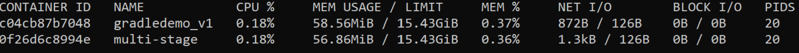

In the image it is possible to identify several fundamental metrics:

- CPU Usage: Both containers present almost identical values, around 0.18%, which indicates that the applications are in an idle state and are not processing significant load. This confirms that the image construction method (traditional vs. multi-stage) does not influence CPU consumption during application execution.

- Memory Used: The memory used by each container is very similar:

      **v1: 58.56 MiB and multi-stage: 56.86 MiB**

The difference is minimal and perfectly normal. This metric only represents the use of the Java process that is inside the container. So, even though the multi-stage image is much smaller, it doesn't change the memory needed to run the JVM and the application.

- Memory Percentage: The percentage of RAM used by each container is around 0.36% – 0.37%. This corresponds to the fact that both have equivalent consumption at the JVM level, regardless of how the image was built.

- Net I/O: The network input/output values are also very close (872B/126B and 1.3kB/126B). This demonstrates that both containers performed only minimal communications, probably related to application startup.

- PIDS: Both containers have 20 PIDs, showing that they both run the same Java application with the same number of internal threads (such as Garbage Collector threads, application execution threads, etc.).

This reinforces that the type of construction (single-stage or multi-stage) does not change the way the JVM creates internal processes.

## Tagging and Publishing Images to Docker Hub

After building the Docker images for each application present in the project (gradle_basic_demo and gradle_transformation), appropriate tags were created for each one, following good versioning and deployment practices.

Tags allow you to easily identify each version of the image, distinguishing between the initial version (without optimization) and the version created using multi-stage build.


After building the images locally, we proceeded to create the tags:

```bash
docker tag gradle_basic_demo:v1 joaoaraujo1250525/gradle_basic_demo:v1
docker tag gradle_basic_demo:multi-stage joaoaraujo1250525/gradle_basic_demo:multi-stage
```
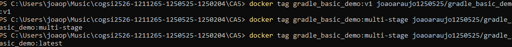

Now to publish, you must first log in to docker hub and run the command:

```bash
docker login
```

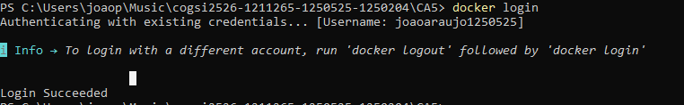

Images were published using the following commands:

```bash
docker push joaoaraujo1250525/gradle_basic_demo:v1
docker push joaoaraujo1250525/gradle_basic_demo:multi-stage
```

### **gradle_basic_demo:v1 push:**

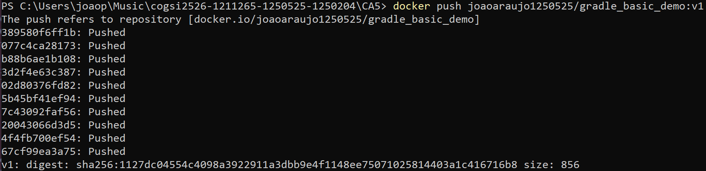

This image shows the push of the version (v1) to Docker Hub. Each *Pushed* line corresponds to the upload of a different layer of the image. As this version includes the entire build environment (Git, Gradle, dependencies, source code and full JDK), the number of layers is large and the upload is heavier. In the end, Docker calculates and presents the SHA256 digest, which uniquely identifies this version of the image in the remote repository.

### **gradle_basic_multi-stage:v1 push:**

The image below shows the sending of the optimized version built with multi-stage. Here, Docker uploads many fewer layers, because the final image contains just the JAR and JRE, without build tools. You can also notice several “Layer already exists” lines, indicating that some layers were already in Docker Hub and did not need to be resubmitted, speeding up the process. The push also ends with the generation of the digest, confirming that the multi-stage image was published successfully.


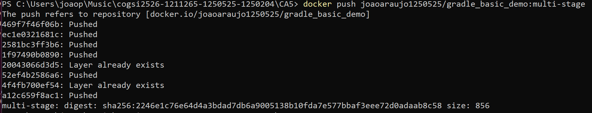

The image below shows proof of the images published on Docker Hub.

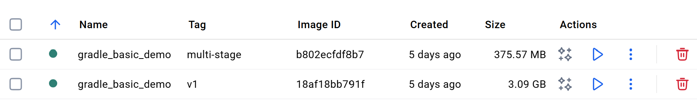

# Part 2: Docker Compose

In Part 2, the goal was to integrate the Spring Boot application and the H2 database into an environment orchestrated through Docker Compose, allowing multiple services to be managed as a single unit. To do this, a docker-compose.yml file was created that defines two main services: the H2 database (db) and the web application (web).

This approach simplifies configuration, ensures automatic communication between services, allows you to control startup orders, manage environment variables, create persistent volumes, and verify the health of containers through health checks.

Tests were also performed to confirm connectivity between containers via hostname, data persistence through volumes, correct transmission of environment variables, and network system operation.

Finally, the images used by Compose were properly tagged and published on Docker Hub, ensuring that they can be run on any machine without the need to recompile the project.

## Running the Application

To start the application:

```bash
docker-compose up
```

To stop the application:

```bash
docker-compose down
```

This code defines a docker-compose file with two services: an H2 database server and a Spring Boot application.

```docker
version: "3.8"

services:
  db:
    image: oscarfonts/h2
    container_name: h2-server
    ports:
      - "1521:1521"     
      - "81:81"         
    environment:
      H2_OPTIONS: "-tcp -tcpAllowOthers -web -webAllowOthers -baseDir /opt/h2-data -ifNotExists"
    restart: always
    volumes:
      - h2-data:/opt/h2-data
    healthcheck:
      test: ["CMD-SHELL", "wget -q -O - http://localhost:81 || exit 1"]
      interval: 10s
      timeout: 5s
      retries: 5

  web:
    build: ./gradle_transformation
    container_name: web-server
    ports:
      - "8080:8080"
    environment:
      - SPRING_DATASOURCE_URL=jdbc:h2:tcp://db:1521/test
      - SPRING_DATASOURCE_USERNAME=sa
      - SPRING_DATASOURCE_PASSWORD=
      - SPRING_DATASOURCE_DRIVER_CLASS_NAME=org.h2.Driver
      - SPRING_JPA_DATABASE_PLATFORM=org.hibernate.dialect.H2Dialect
      - SPRING_JPA_HIBERNATE_DDL_AUTO=update
    depends_on:
      db:
        condition: service_healthy

volumes:
  h2-data:
```

The db service uses the oscarfonts/h2 image, exposes ports 1521 and 81, activates server mode and the H2 web console, stores data in a persistent volume called h2-data and has a healthcheck to ensure that the database is working before other services start. The web service is built from the ./gradle_transformation folder, exposes port 8080 and receives environment variables that configure the connection to H2. It depends on the db service and only starts when the database is healthy. The file also defines the h2-data volume, used to maintain database data even after reboots.

## Health Check

We added a `healthcheck` to the `db` service to ensure it is fully ready before the `web` service starts. Comprueba que la consola web responde correctamente: It runs every 10 seconds. If it fails 5 times, the service is considered *unhealthy*. This is important so that the web service only starts when the DB is ready.

The check uses `wget` to ping the web console port (81).

The `web` service uses `depends_on` with `condition: service_healthy` to wait for the database.

## Data Persistence:
We defined a named volume `h2-data`.

This volume is mounted to `/opt/h2-data` inside the `db` container.

We configured `H2_OPTIONS` with `-baseDir /opt/h2-data` to ensure the database files are stored in the volume.
This ensures that data persists even if the container is removed or restarted.

## Network Connectivity

Docker Compose automatically creates a default network for the services. This allows containers to communicate with each other using their service names as hostnames.

- **web**: Can resolve the database at `db:1521` or `db:81`.
- **db**: Can resolve the web service at `web:8080`.

This eliminates the need for manual IP management and ensures reliable communication between services.

## Verification

### Network Connectivity
We verified that the containers can communicate with each other using their service names as hostnames.

**1. Web to DB**
The `web` container can resolve `db` and connect to port 81.

```bash
docker exec web-server curl -v http://db:81
```

**2. DB to Web**
The `db` container can resolve `web` and connect to port 8080.

```bash
docker exec h2-server curl http://web:8080
```

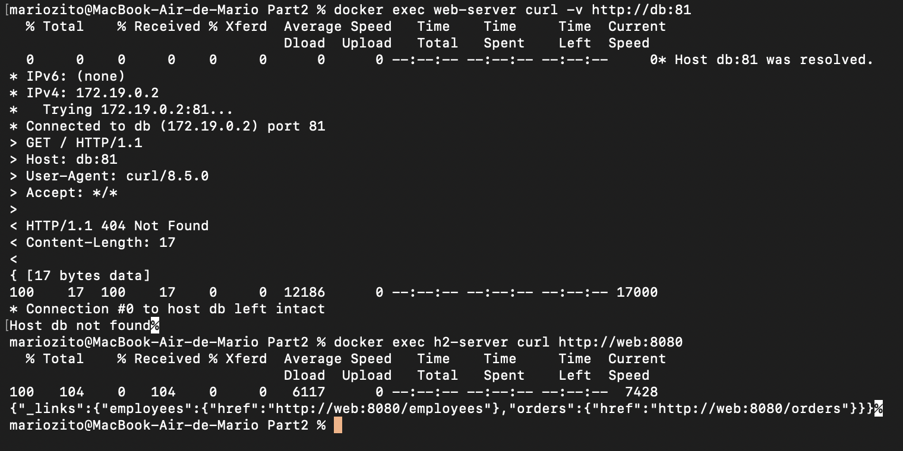

### Persistence
We verified persistence by creating a file in the volume, restarting the container, and confirming the file still existed.

1. Create a test file:
```bash
docker exec h2-server touch /opt/h2-data/test_persistence.txt
```

2. Restart the database container:
```bash
docker-compose restart db
```

3. Check if the file still exists:
```bash
docker exec h2-server ls -l /opt/h2-data/test_persistence.txt
```

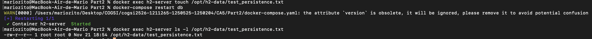

### Environment Variables
We verified that the environment variables are correctly passed to the application container.

```bash
docker exec web-server env
```

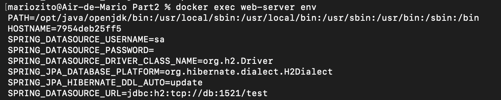

## Push to Docker Hub

To publish the images to Docker Hub, we first need to tag them with our username and then push them.

### 1. Tagging Images

We tag the `web` image (built by compose) and the `db` image (used by compose).

**Web Image:**
```bash
docker tag part2-web mariozito/part2-web:latest
```

**DB Image:**
```bash
docker tag oscarfonts/h2 mariozito/part2-db:latest
```

![Insert screenshot of tagging images here]

### 2. Pushing Images

**Push Web Image:**
```bash
docker push mariozito/part2-web:latest
```

**Push DB Image:**
```bash
docker push mariozito/part2-db:latest
```

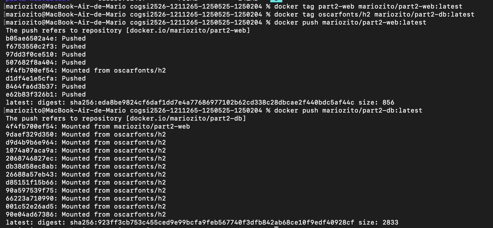

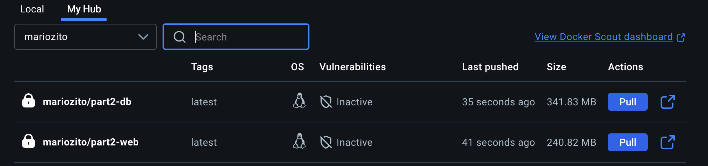

## Alternative Solution

### Introduction

Before starting the assignment, I had to pick one specific container tool to replace Docker. There are a few options out there (Podman, LXC/LXD, systemd-nspawn, containerd, etc.), after researching a bit, Podman ended up being the most logical choice.
This assignment required me to design, analyze, compare, and implement an alternative container management solution that does not rely on Docker. The goal was not just to replace Docker with another tool but to understand:

- How the alternative tool functions

- How it compares to Docker 

- How the alternative tool can be used to achieve the exact same goals of the original assignment

- How to implement the design in a working setup

To meet all these requirements, I selected Podman as the alternative container engine. Podman is widely recognized as the most Docker compatible substitute while offering additional security and architectural benefits.

### Why I chose Podman

Out of all the Docker alternatives available today, Podman made the most sense for this assignment.
The main reasons were:

1. It doesn’t use a daemon, which makes it safer.
Docker relies heavily on a background service called the Docker daemon,while Podman does not have this, and it just runs the containers directly without needing a separate running process

This gives Podman two advantages:

- Better security (no daemon running all the time)

- Fewer failure points (if a service crashes, it doesn’t bring containers down)

2. It supports rootless containers.
This means containers can run without requiring admin permissions while Docker can’t always do this properly, especially on Windows.
This matters because running containers as root can sometimes be risky, and Podman avoids that by design.

3. It follows the same OCI standards as Docker.
This basically means Podman follows the same container standards that Docker does. Because of this, Podman can:

- use Docker images

- push/pull from Docker registries

- run containers using the same image format

So there is no need to convert anything and the transition is smooth.

4. It can use the same Dockerfiles and almost the same commands
This was the main reason choosing Podman made life easier for this assignment, since the goal wasn’t to redesign the whole workflow but just use an alternative tool, this compatibility was helpful

Basically, Podman works very similarly to Docker, but with a different architecture and some extra advantages.
Because of this, I could follow almost the same workflow as the Docker version of the assignment, just using Podman commands instead

| Feature                  | Docker	             | Podman	           | Which is Better? |
| ------------------------ | ------------------- | ----------------- | ---------------  | 
| Runs daemon              | Yes (Docker Daemon) | No daemon	       | Podman is safer  |
| Rootless                 | containers	 Limited | Full rootless	   | Podman           |
| Dockerfile support	     | Yes	               | Yes	             | Equal            |
| Docker CLI compatibility | Native	             | Mostly compatible | Almost equal     |
| Compose support	         | docker‑compose	     | podman‑compose	   | Equal            |
| Security	               | Medium	             | High	             | Podman           |


### Architectural Differences

Podman's architecture was built following the principle of being completely daemonless. This means that each container runs as an independent process started directly by the user. This approach reduces internal complexity and eliminates the risk of a central failure stopping all containers at the same time.

Docker, on the other hand, depends on a monolithic daemon that controls everything, including images, storage, networks and execution. While this makes it easier to use, it also creates a single point of failure. If the daemon needs to restart, all containers linked to it are interrupted. Another important difference is that Podman uses conmon — a small, isolated process that only monitors the container and records logs. This makes the system more modular, allowing you to replace or upgrade individual components without impacting the entire platform.

Additionally, Podman was designed to work directly with OCI runtimes such as crun and runc, ensuring greater compatibility with open standards and less dependence on proprietary components.

### Security Differences

Podman's security model is more aligned with modern process isolation practices. Some advantages include:

- Extensive use of user namespaces: allows an unprivileged user to run containers by mapping UID/GID to the host machine, which drastically reduces the attack surface.

- Native SELinux and AppArmor compatibility: Podman leverages these access control systems without requiring additional configuration.

- Lack of privileged process: as there is no daemon running as root, the risk of an exploit gaining elevated privileges through a central service is practically eliminated.

- Containers as child processes of the user: This facilitates audits and monitoring, as permissions applied to the user on the host also apply to the container.

These features make Podman more appropriate for corporate environments, servers exposed to the internet and systems where the security policy has zero tolerance for privileged processes.

### Integration Differences

Podman's integration with the operating system is deeper than Docker's, especially on modern Linux systems, for example when it comes to:

- Direct integration with systemd: Podman can automatically generate systemd service files, allowing containers to function as native machine services. This facilitates automation, automatic restart, logs, and execution policies.

- Use of CNI for networking: Podman uses the same networking technology used by Kubernetes, which makes it easier to migrate workloads to clusters in the future.

- Better compatibility with multi-user environments: Since there is no centralized daemon, multiple users can run containers simultaneously without competing for a single global service.

- Independent storage per user: each user has their own space for images, containers and volumes, increasing isolation and avoiding conflicts.

These features make Podman particularly interesting in universities, shared development servers, CI/CD infrastructures, and environments where per-user isolation is critical.

### Workflow Differences

Even though it maintains compatibility with most Docker commands, Podman introduces some improvements to the workflow:

- The absence of the daemon allows you to start containers faster.

- Debugging containers is simpler, as each container is a regular process on the system, visible in commands like ps and easy to monitor.

- Integration with systemd makes automatic startup and supervision processes simpler. Podman's tools were designed from the ground up for production environments without elevated privileges.

These improvements help make management more predictable and secure.

In conclusion:

- Podman is more secure (no daemon, rootless)

- Podman is Docker‑compatible (same commands)

- Podman uses systemd integration, better for servers

This makes Podman a good alternative solution to docker

The assignment required designing how the alternative tool (Podman) could solve the same goals as the original Docker solution.

- Build the application with podman build
- Run the application with podman run -p 8080:8080
- Run a database with Podman container running H2
- Connect application with database usingg same networking logic as Docker

## Implementation of Alternative Solution - Podman

### 1. Installing Podman

Before I could replace Docker with Podman, I needed to install all the tools required to run containers on my machine.
This part is important because Podman by itself is only the container engine and some extra tools are needed to make everything work smoothly, especially for scripting or running multi container setups.

Podman is the main tool I needed, so the first thing I did was install it using the official package command for my system


This ensures:

-podman - the engine (to run and build containers), the CLI interface (for Podman commands), the tools required for rootless mode

-pip / curl / jq - tools needed for scripts

-podman-compose - Docker‑Compose equivalent for Podman 
This tool behaves almost the same as docker-compose and allows me to run multiple containers together,combine the Spring Boot app + H2 database,treat the entire stack as a single environment

Afterwards we check the installation is complete


This step matters because if Podman is not properly installed, the later steps (building images, running containers) will fail

### 2. Building the application with Podman

We replaced Docker builds with Podman builds, because Podman can build Dockerfiles directly without changing them.
In Docker, you normally build an image like this:

```bash
docker build -t gradle_transformation
```
With Podman i simply replaced docker with :

This command reads the Dockerfile in the current folder then it downloads the required base image while compiling the code. After this it packages the Spring Boot application and creates a container image

Podman handled the entire build process smoothly because it understands Dockerfiles so this means zero configuration changes were needed.

While the image was building, I could see logs showing:

- dependencies being downloaded

- the Spring Boot project being compiled

- files being copied into the container

- the final image being created

The important part is that Podman produced the exact same final image that Docker would have produced but just with a different engine behind it and this allowed it to produce the container image


### 3. Running the application container

After building the Spring Boot application image with Podman, the next step was to actually run the container and confirm that the app starts correctly.
This part is basically the equivalent of what we usually do with Docker’s "docker run", but now we do it with Podman.


This command:

- starts a container from the image I built earlier

- maps port 8080 inside the container to 8080 on the host

- lets me access the Spring Boot app from my browser

- shows the Spring Boot logs directly in the terminal
This behavior is exactly the same as Docker, which is why Podman is considered Docker compatible

Once the logs showed everything was running, I opened:

```bash
http://localhost:8080
```

The Spring Boot app loaded the same way it did in the Docker version of the assignment.
This proves Podman can run the application fully by itself, without relying on Docker at all.

### 4. Running H2 database inside Podman

The original Docker based project used a Docker container to run an H2 database but since Docker wasn’t allowed in this assignment, I had to recreate the same environment using only Podman.

That meant:

- setting up H2 as a containerized service,

- making sure the database persisted somewhere, and ensuring that the Spring Boot app could still connect to it.

So I built the same setup using Podman.

#### 4.1 Create folder for persistent H2 data

Before starting the H2 server, I first created a local folder where the database files would be stored


This step matters because:

- without a mounted folder, H2 would store everything inside the container

- when the container stops, all data would be lost

By creating a local directory, I ensured that the H2 data survives restarts, just like with a real database container.

#### 4.2 Download the H2 database JAR

H2 is a lightweight Java database, and running it requires its JAR file.

So I downloaded it manually using this commandd


This step ensures that:

- the container can actually run the H2 server

- the database engine exists in the environment

- Podman doesn’t have to pull anything from Docker Hub 

Basically, this was preparing the tools needed to start H2 in standalone mode.

#### 4.3 Start the H2 server

Once the folder and the JAR were ready, I used Podman to start the H2 server.
This shows the command running:


Inside the container, H2 starts and:

- opens an HTTP console on port 8082

- listens for JDBC connections

- stores its files in the mounted directory

- behaves exactly as it would in a Docker container

This step recreates the same database environment as the Docker version of the assignment.

### 5. Connecting to H2

After getting the H2 server running inside Podman, the next thing I needed to do was actually connect to it.
This step is important because running the database alone doesn’t prove anything so the Spring Boot app needs to be able to use it, and I also needed to check if the H2 interface was accessible.

So, once H2 was running, I did two things:

##### Open the H2 Web Console

H2 provides a small web interface that runs on port 8082.
So I opened the browser and went to:

```bash
http://localhost:8082
```


This page lets you:

- verify that H2 actually started correctly

- log into the database

- run SQL queries

- check if the mounted folders are working correctly

Just being able to load this page meant that Podman exposed the ports correctly and the H2 service was working exactly the same as it would in Docker.

##### Log into the H2 Database
Once the H2 console loaded, I used the login details


Logging in confirmed:

- the H2 server is running

- the directory where data is stored is configured correctly

- the JDBC URL is correct.


