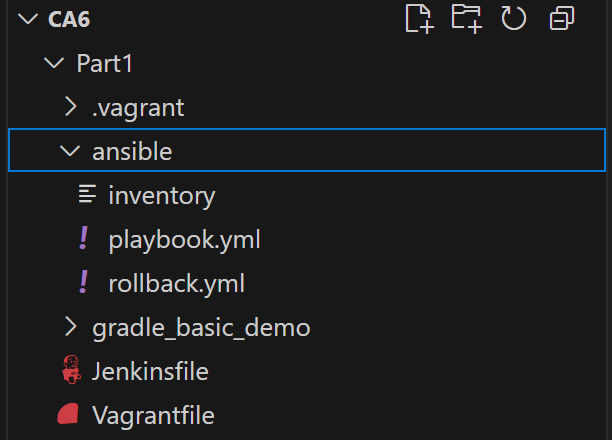
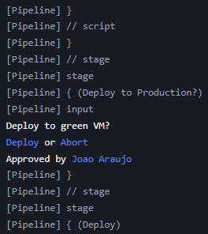
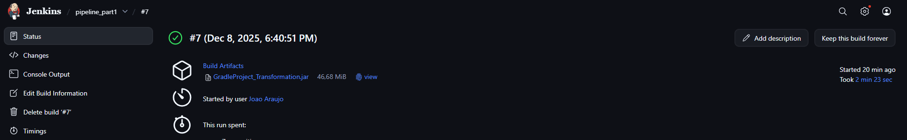
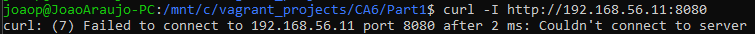
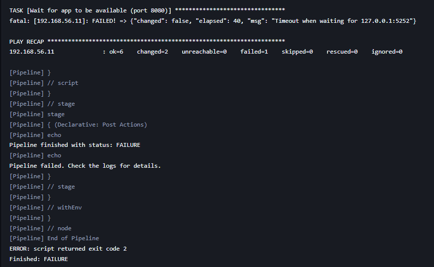
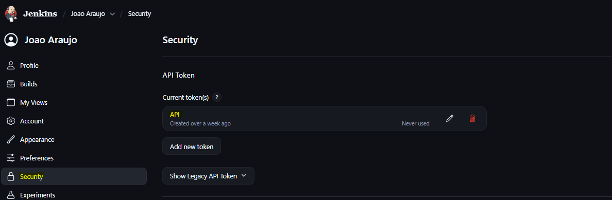
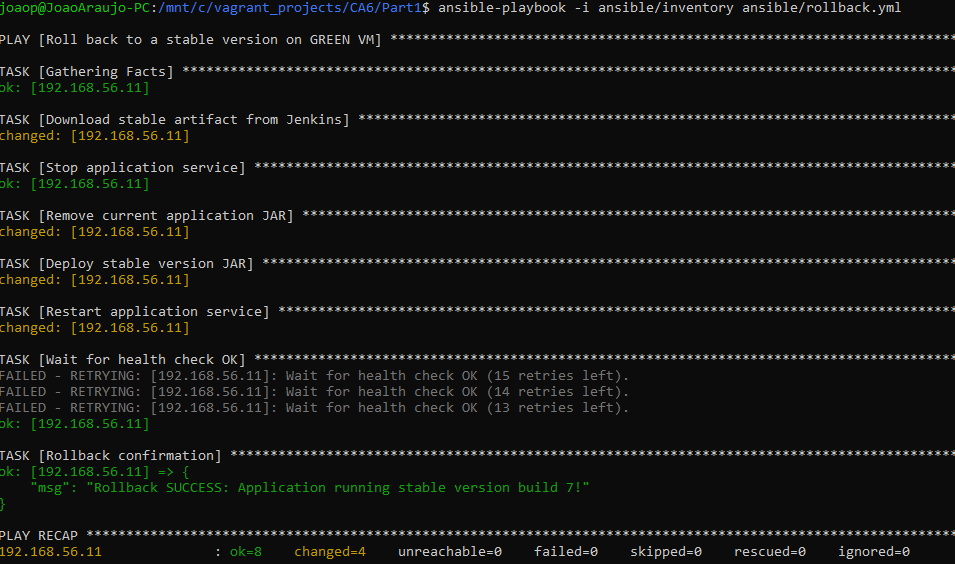
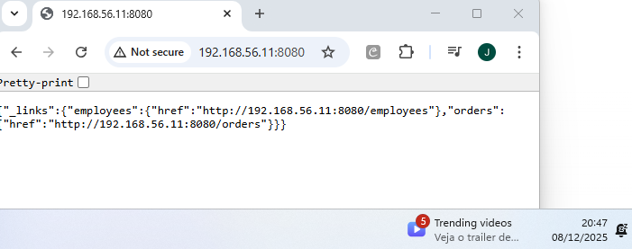

# CA6 - Jenkins

## Part 1

The main objective of this first part consists of implementing a CI/CD pipeline, using Jenkins, that automates the entire process of creating infrastructure and deploying a Spring Boot application (Building REST Services with Spring), compiled via Gradle.

Two virtual machines were first created: the blue machine and the green machine using Vagrant. The blue VM represents the current production environment, and the green VM, with a deploy that is manually approved, must receive a new version of the application. The pipeline compiles, tests, archives the artifact, provisions the infrastructure and ends with the deployment via Ansible on the VM green, and lastly, health checks are carried out.

## Structure of this project in part 1

The structure of this project for Part 1 is as follows:




## Virtual Machines in Vagrant 

The code presented below corresponds to the *Vagrantfile* , responsible for the automated creation of the two virtual machines. The file starts by checking the host system architecture to ensure the correct Vagrant box is used, differentiating between ARM machines and x86 machines with VirtualBox. Then, two virtual machines are defined: **blue** and **green**.

Each VM receives a different private IP address on the same Host-Only network (192.168.56.10 on the blue machine and IP 192.168.56.11 on the green machine), allowing the application to be accessed from the host. Additionally, the hostname of each machine and its resources are configured, such as amount of memory and number of CPUs. 
In fact, there was a need to carry out the vagrant with such a conditional structure, as not all elements of the group contain the same host operating system and architectures.


```bash
Vagrant.configure("2") do |config|
  host_arch = RbConfig::CONFIG['host_cpu']

  if host_arch.include?("arm")
    config.vm.box = "spox/ubuntu-arm"
    provider_name = "vmware_desktop"
  else
    config.vm.box = "bento/ubuntu-22.04"
    provider_name = "virtualbox"
  end

  config.vm.define "blue" do |blue|
    blue.vm.network "private_network", ip: "192.168.56.10"
    blue.vm.hostname = "blue"
    blue.vm.provider provider_name do |v|
      v.memory = "2048"
      v.cpus = 2
      v.gui = false if provider_name == "vmware_desktop"
    end
  end

  config.vm.define "green" do |green|
    green.vm.network "private_network", ip: "192.168.56.11"
    green.vm.hostname = "green"
    green.vm.provider provider_name do |v|
      v.memory = "2048"
      v.cpus = 2
      v.gui = false if provider_name == "vmware_desktop"
    end
  end
end
```
Finally, these settings allow the *vagrant up* command, applied at a later stage, to automatically create the environment necessary for executing and deploying the application in Spring Boot. 

## Ansible to provisioning and deploy

Ansible is used to provision the VMs and deploy the application. The `playbook.yml` performs the following tasks:

1.  **Install OpenJDK 17**: Ensures the Java runtime is available.
```yaml
- name: Install OpenJDK 17
  apt:
    name: openjdk-17-jdk
    state: present
    update_cache: yes
```
2.  **Create Application Directory**: Sets up `/opt/spring-app`.
```yaml
- name: Create application directory
  file:
    path: "{{ app_dir }}"
    state: directory
    mode: '0755'
    owner: vagrant
    group: vagrant
```
3.  **Copy Application JAR**: Transfers the built artifact from the host to the VM.
```yaml
- name: Copy application JAR
  copy:
    src: "{{ jar_source }}"
    dest: "{{ jar_dest }}"
    mode: '755'
    owner: vagrant
    group: vagrant
```
4.  **Create Systemd Service**: Defines a service `spring-app` to manage the application lifecycle.
```yaml
- name: Create systemd service
  copy:
    dest: /etc/systemd/system/spring-app.service
    content: |
      [Unit]
      Description=Spring Boot Application on Green
      After=network.target

      [Service]
      User=vagrant
      ExecStart=/usr/bin/java -jar {{ jar_dest }}
      Restart=always
      RestartSec=5
      SuccessExitStatus=143

      [Install]
      WantedBy=multi-user.target
  notify:
    - Restart Spring App
```
5.  **Start Service**: Enables and starts the application.
```yaml
- name: Reload systemd and start service
  systemd:
    name: spring-app
    enabled: yes
    state: started
    daemon_reload: yes
```

6. Health Check / Waiting for Application: Ensures that the application is running correctly by validating access to port 8080.

```yaml
- name: Wait for app to be available (port 8080)
  wait_for:
    port: 8080
    delay: 3
    timeout: 40
```

7. Handler: Restart Spring App:If the service file is changed, Ansible automatically restarts the application.


```yaml
handlers:
  - name: Restart Spring App
    systemd:
      name: spring-app
      state: restarted
      daemon_reload: yes
```

The code in its entirety can be found in the file *[playbook.yml](./Part1/ansible/playbook.yml)*

## Jenkins Pipeline 

The pipeline was implemented in Jenkins using a Jenkinsfile stored in the repository. Below we describe each step of the CI/CD process sequentially, explaining its objective and how the code works in the two different operating systems.
The `Jenkinsfile` defines the CI/CD pipeline with the following stages:

### 1. Checkout
Pulls the latest source code from the repository. Jenkins uses the SCM configuration associated with the job, performing automatic *git pull*.

```groovy
stage('Checkout') {
    steps {
        checkout scm
    }
}
```

If there are changes in the branch, they will be automatically included in the pipeline before starting the build.

### 2. Assemble
Compiles the code and produces the artifact files using Gradle, that's,Compiles Spring Boot application using Gradle.
Since Jenkins is installed on Windows, but Gradle and Java are inside WSL (Ubuntu), you need to run the commands using:

- **sh** - when Jenkins runs on Linux/macOS;
- **bat** with WSL.exe + bash in Powershell Terminal - when Jenkins runs on Windows.

```groovy
stage('Assemble') {
    steps {
        script {
            if (isUnix()) {
                sh """
                cd ${REPO_PATH_MAC}/gradle_basic_demo
                chmod +x gradlew
                ./gradlew clean assemble --no-daemon
                """
            } else {
                bat """C:\\Windows\\System32\\wsl.exe bash -lc "cd ${REPO_PATH_WSL}/gradle_basic_demo && chmod +x gradlew && ./gradlew clean assemble --no-daemon" """
            }
        }
    }
}
```

The --no-daemon option prevents Gradle from keeping processes in the background, ideal in a pipeline where execution is punctual. At the end, the JAR artifact is generated in the libs folder (within the following path):

```
gradle_basic_demo/build/libs/
```

### 3. Test

Now, in this stage, runs unit tests to verify the application's correctness and finally, After the tests, the .xml files generated by JUnit are copied to the Jenkins workspace and finally the results are published.

```groovy
stage('Test') {
    steps {
        script {
            if (isUnix()) {
                sh "cd ${REPO_PATH_MAC}/gradle_basic_demo && ./gradlew test"
            } else {
                bat """C:\\Windows\\System32\\wsl.exe bash -lc "cd ${REPO_PATH_WSL}/gradle_basic_demo && ./gradlew test --no-daemon" """
                bat """C:\\Windows\\System32\\wsl.exe bash -lc "cp ${REPO_PATH_WSL}/gradle_basic_demo/build/test-results/test/*.xml /mnt/c/ProgramData/Jenkins/.jenkins/workspace/${JOB_NAME}/" """
            }
        }
    }
    post {
        always {
            junit "*.xml"
        }
    }
}
```

The "*.xml" jUnit publishes the tests in Jenkins, allowing you to view graphs and success or failure histories.

### 4. Archive

The JAR is copied from the build folder to the Jenkins workspace, becoming an artifact accessible to other parts of the pipeline or future deployments. The *fingerprint: true* option guarantees traceability of this artifact.

```groovy
 stage('Archive') {
    steps {
        script {
            if (isUnix()) {
                sh """cp ${REPO_PATH_MAC}/gradle_basic_demo/build/libs/${JAR_NAME} ${WORKSPACE}/"""
            } else {
                bat """C:\\Windows\\System32\\wsl.exe bash -lc "cp -f ${REPO_PATH_WSL}/gradle_basic_demo/build/libs/${JAR_NAME} /mnt/c/ProgramData/Jenkins/.jenkins/workspace/${JOB_NAME}/" """
            }
        }
        archiveArtifacts artifacts: "${JAR_NAME}", fingerprint: true
    }
}
```

### 5. Provision Infrastructure

Here the infrastructure is automated via Vagrant.
Jenkins starts the blue and green VMs, which were defined in the Vagrantfile.

If the VMs already exist, they will just be started.

```groovy
stage('Provision Infrastructure') {
    steps {
        script {
            if (isUnix()) {
                sh "cd ${REPO_PATH_MAC} && vagrant up"
            } else {
                bat "cd C:\\vagrant_projects\\CA6\\Part1 && vagrant up"
            }
        }
    }
}
```

### 6. Deploy to Production?
A manual approval step, where the pipeline pauses here until a user manually approves the deployment to the production environment.

```groovy
stage('Deploy to Production?') {
    steps {
        input message: 'Deploy to green VM?', ok: 'Deploy'
    }
}
```




### 7. Deploy
The final stage of the pipeline performs the deployment to the production environment, represented by the green virtual machine. This step only executes after a manual approval is granted in the previous stage. The deployment process consists of securely transferring the JAR artifact and executing the Ansible playbook that will install Java, copy the application, configure a systemd service, and start the application inside the VM.

Because this Jenkins pipeline must support two different host environments (Windows hosts using WSL and Linux/macOS hosts natively), logic is included to detect the corresponding agent type.
This ensures the correct SSH key is located and securely handled in both cases.

```groovy
        stage('Deploy') {
            steps {
                script {
                    def keySource = "${REPO_PATH_WSL}/.vagrant/machines/green/virtualbox/private_key"
                    def keyUnix = "${REPO_PATH_MAC}/.vagrant/machines/green/vmware_desktop/private_key"
                    def keyWSL = "/tmp/private_key"

                    if (isUnix()) {
                        sh """
                        cp "${keyUnix}" /tmp/private_key
                        chmod 600 /tmp/private_key
                        ssh -i /tmp/private_key -o StrictHostKeyChecking=no vagrant@192.168.56.11 "echo SSH OK!"
                        ansible-playbook -i "${REPO_PATH_MAC}/ansible/inventory" \
                                         "${REPO_PATH_MAC}/ansible/playbook.yml" \
                                         --limit green \
                                         --extra-vars "jar_source=${REPO_PATH_MAC}/gradle_basic_demo/build/libs/${JAR_NAME} ansible_ssh_private_key_file=/tmp/private_key"
                        """
                    } else {
                        bat """
                        C:\\Windows\\System32\\wsl.exe bash -lc 'cp "${keySource}" "${keyWSL}"'
                        C:\\Windows\\System32\\wsl.exe bash -lc 'chmod 600 "${keyWSL}"'
                        C:\\Windows\\System32\\wsl.exe bash -lc 'ssh -i "${keyWSL}" -o StrictHostKeyChecking=no vagrant@192.168.56.11 "echo SSH OK!"'
                        C:\\Windows\\System32\\wsl.exe bash -lc 'ansible-playbook -i "${REPO_PATH_WSL}/ansible/inventory" "${REPO_PATH_WSL}/ansible/playbook.yml" --limit green --extra-vars "jar_source=${REPO_PATH_WSL}/gradle_basic_demo/build/libs/${JAR_NAME} ansible_ssh_private_key_file=${keyWSL}"'
                        """
                    }
                }
            }
        }  
```

### Explanation of what this stage does

1. **Defines the location of the SSH private key**: Vagrant generates different directory paths depending on provider and OS.

2. **Copies the private key safely**:

- Linux/macOS directly copies the key from the Vagrant folder.
- Windows uses WSL to access Linux paths under /mnt/c/...
- This avoids security restrictions that prevent direct access from Jenkins.

3. **Validates SSH connectivity**: A simple SSH command ("echo SSH OK!") ensures Jenkins can reach the VM before attempting deployment.

4. **Executes the Ansible playbook** - This automates the real deployment steps/tasks:

- Installing JDK inside the VM

- Creating the application folder

- Copying the JAR artifact

- Creating and enabling the systemd service

- Starting the Spring Boot application

- Waiting for the app to become fully available (port 8080).

The code in its entirety can be found in the file *[Jenkinsfile](./Part1/Jenkinsfile)*

The image below shows proof that the Jenkins pipeline was successfully executed and completed in its entirety.


## Ansible Rollback

Rollback is an essential functionality in production pipelines, ensuring that, if a new version of the application fails, it is possible to return to a previous version that had already been validated as stable.

To achieve this objective, an Ansible playbook capable of:

- Automatically get JAR artifact directly from Jenkins
- Replace the JAR currently in production with a version marked as stable
- Restart the application service on the green VM
- Check if the application works correctly again

This process is automated in order to reduce the need for manual intervention and minimize downtime. Below is a detailed explanation of the main steps of the rollback playbook:

1. **Download stable version of Jenkins**: The artifact is downloaded from Jenkins using the job, build number and API credentials.
This file will be used to replace the problematic version that was running.

```yaml
- name: Download stable artifact from Jenkins
  get_url:
    url: "{{ jenkins_url }}/job/{{ jenkins_job }}/{{ rollback_build }}/artifact/{{ artifact_name }}"
    dest: "/tmp/rollback.jar"
    url_username: "{{ jenkins_user }}"
    url_password: "{{ jenkins_token }}"
    mode: "0755"
```

2. **Stop the application service**: Before replacing the old JAR, the service is stopped, ensuring that there are no files blocked from execution.

```yaml
- name: Stop application service
  ansible.builtin.systemd:
    name: "{{ service_name }}"
    state: stopped
  ignore_errors: yes
```

3. **Remove the current JAR**: With the application stopped, the current version of the artifact is removed to make way for the stable version.
```yaml
    - name: Remove current application JAR
      file:
        path: "{{ deploy_dir }}/{{ artifact_name }}"
        state: absent
```

4. **Install the stable version**: The new artifact (obtained in step 1) is placed in the correct location and is ready to be run by the systemd service.
```yaml
    - name: Deploy stable version JAR
      copy:
        src: "/tmp/rollback.jar"
        dest: "{{ deploy_dir }}/{{ artifact_name }}"
        mode: '0755'
        remote_src: yes

```

5. **Restart the application**: The systemd service is activated again with the previous version of the artifact.
```yaml
    - name: Restart application service
      ansible.builtin.systemd:
        name: "{{ service_name }}"
        enabled: yes
        state: restarted
```

6. **Check the success of the operation (Health Check)**: The rollback is only considered completed successfully if the application responds correctly on the main endpoint again.
```yaml
    - name: Wait for health check OK
      uri:
        url: "{{ health_url }}"
        method: GET
        status_code: 200
      register: health_check
      retries: 15
      delay: 4
      until: health_check.status == 200
```

7. **Rollback confirmation**: If all previous steps were successful, a success message is issued.

```yaml
    - name: Rollback confirmation
      debug:
        msg: "Rollback success!"
```

The rollback playbook guarantees a quick and safe return to a previous, stable version of the application, minimizing potential service interruptions and negative impacts for the user. The code in its entirety can be found in the file *[rollback.yml](./Part1/ansible/rollback.yml)*

### Demonstration of Rollback working

In this section we will simulate a real scenario where a new deployment causes problems in the production environment (VM green). When this happens, we trigger the rollback process to restore a version that was previously validated as stable. The application starts but displays an unexpected error. The system state becomes unstable and it is necessary to restore the previous version recognized as stable.
To validate the issue, we make a manual HTTP request to the green VM:



From the image above it can be seen that it is not possible to connect to the service.

Below is part of the deployment failure log and the respective pipeline.




To apply rollback, we had to go to the rollback code and adjust the following code snippet with the following attributes:

```yaml
  vars:
    jenkins_url: "http://192.168.56.1:8080"
    jenkins_job: "pipeline_part1"
    artifact_name: "GradleProject_Transformation.jar"  
    rollback_build: "7"        
    jenkins_user: "joaoaraujo1250525"  
    jenkins_token: "1190fe1385012481a56025088c376e6c50"
    deploy_dir: "/opt/spring-app"
    service_name: "spring-app.service"
    health_url: "http://192.168.56.11:8080"
```

| Variable | Function |
| ------------------ | ---------------------------------------------------------------------------------- |
| **jenkins_url** | URL of the Jenkins server where the artifacts are stored |
| **jenkins_job** | Name of the job/pipeline where the artifact was produced |
| **artifact_name** | Name of the JAR file that will be restored |
| **rollback_build** | Jenkins *build* number considered stable and being recovered |
| **jenkins_user** | Username for Jenkins authentication (required to download the artifact) |
| **jenkins_token** | API Token generated in Jenkins for secure authentication |
| **deploy_dir** | Directory on the VM where the artifact is installed |
| **service_name** | Name of the systemd service that runs the application |
| **health_url** | Address used to validate that the application is working again after rollback |


These variables allow you to identify the stable version of the artifact, automatically transfer that artifact to the green VM, replace the problematic version, restart the Spring Boot service and, finally, validate correct operation with a health check. Build version 7 was chosen as it is the stable version.

In the image below we demonstrate how we create the token in Jenkins, and as you can see it is already created and the token value is already in the rollback file.


Finally, we run the command **ansible-playbook -i ansible/inventory ansible/rollback.yml** and the result is explained in the following image. The tasks were performed successfully.


To rectify this, we consulted the website **http://192.168.56.11:8080** and in the following image we found the following information:

