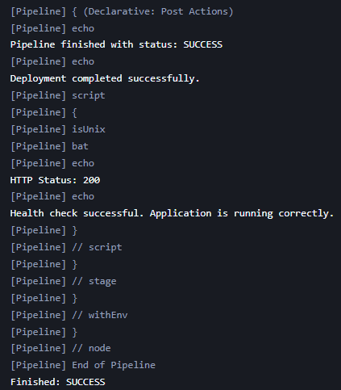
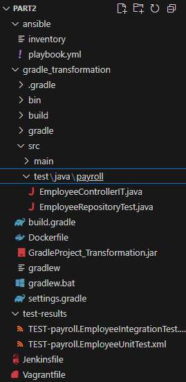
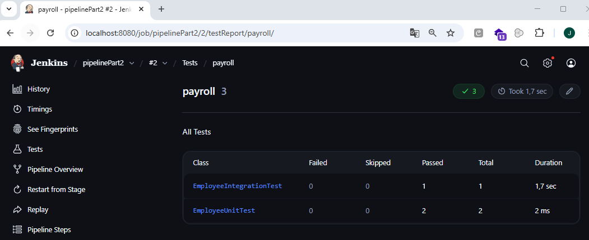
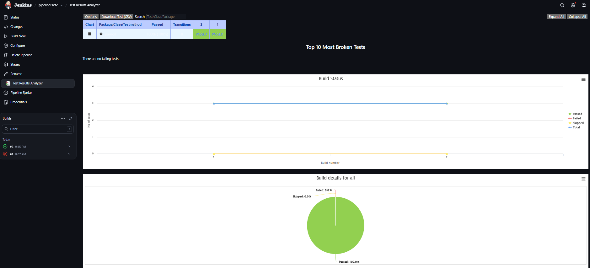
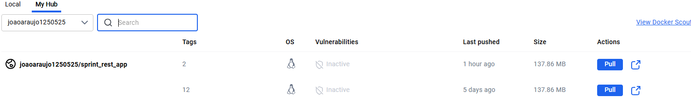
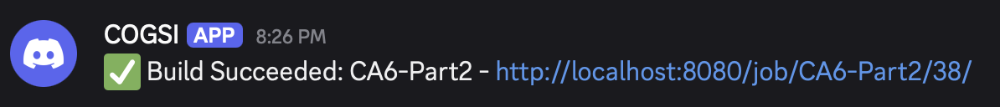

# CA6 - Jenkins

In this work, a complete CI/CD solution was developed with the goal of automating the entire continuous integration, delivery, and deployment process, ensuring faster, more reliable, and controlled updates of the application throughout its lifecycle. The project is divided into two distinct parts. 


In Part 1, the application is compiled and distributed directly to two virtual machines. In Part 2, the same application is packaged in a Docker container, with automated publishing and configured with Ansible. Finally, the alternative solution using GitHub Actions is presented, allowing comparison between different CI/CD automation solutions.

## Part 1

The main objective of this first part consists of implementing a CI/CD pipeline, using Jenkins, that automates the entire process of creating infrastructure and deploying a Spring Boot application (Building REST Services with Spring), compiled via Gradle.

Two virtual machines were first created: the blue machine and the green machine using Vagrant. The blue VM represents the current production environment, and the green VM, with a deploy that is manually approved, must receive a new version of the application. The pipeline compiles, tests, archives the artifact, provisions the infrastructure and ends with the deployment via Ansible on the VM green, and lastly, health checks are carried out.

## Structure of this project in part 1

The structure of this project for Part 1 is as follows:


## Virtual Machines in Vagrant 

The code presented below corresponds to the *Vagrantfile* , responsible for the automated creation of the two virtual machines. The file starts by checking the host system architecture to ensure the correct Vagrant box is used, differentiating between ARM machines and x86 machines with VirtualBox. Then, two virtual machines are defined: **blue** and **green**.

Each VM receives a different private IP address on the same Host-Only network (192.168.56.10 on the blue machine and IP 192.168.56.11 on the green machine), allowing the application to be accessed from the host. Additionally, the hostname of each machine and its resources are configured, such as amount of memory and number of CPUs. 
In fact, there was a need to carry out the vagrant with such a conditional structure, as not all elements of the group contain the same host operating system and architectures.


```bash
Vagrant.configure("2") do |config|
  host_arch = RbConfig::CONFIG['host_cpu']

  if host_arch.include?("arm")
    config.vm.box = "spox/ubuntu-arm"
    provider_name = "vmware_desktop"
  else
    config.vm.box = "bento/ubuntu-22.04"
    provider_name = "virtualbox"
  end

  config.vm.define "blue" do |blue|
    blue.vm.network "private_network", ip: "192.168.56.10"
    blue.vm.hostname = "blue"
    blue.vm.provider provider_name do |v|
      v.memory = "2048"
      v.cpus = 2
      v.gui = false if provider_name == "vmware_desktop"
    end
  end

  config.vm.define "green" do |green|
    green.vm.network "private_network", ip: "192.168.56.11"
    green.vm.hostname = "green"
    green.vm.provider provider_name do |v|
      v.memory = "2048"
      v.cpus = 2
      v.gui = false if provider_name == "vmware_desktop"
    end
  end
end
```
Finally, these settings allow the *vagrant up* command, applied at a later stage, to automatically create the environment necessary for executing and deploying the application in Spring Boot. 

## Ansible to provisioning and deploy

Ansible is used to provision the VMs and deploy the application. The `playbook.yml` performs the following tasks:

1.  **Install OpenJDK 17**: Ensures the Java runtime is available.
```yaml
- name: Install OpenJDK 17
  apt:
    name: openjdk-17-jdk
    state: present
    update_cache: yes
```
2.  **Create Application Directory**: Sets up `/opt/spring-app`.
```yaml
- name: Create application directory
  file:
    path: "{{ app_dir }}"
    state: directory
    mode: '0755'
    owner: vagrant
    group: vagrant
```
3.  **Copy Application JAR**: Transfers the built artifact from the host to the VM.
```yaml
- name: Copy application JAR
  copy:
    src: "{{ jar_source }}"
    dest: "{{ jar_dest }}"
    mode: '755'
    owner: vagrant
    group: vagrant
```
4.  **Create Systemd Service**: Defines a service `spring-app` to manage the application lifecycle.
```yaml
- name: Create systemd service
  copy:
    dest: /etc/systemd/system/spring-app.service
    content: |
      [Unit]
      Description=Spring Boot Application on Green
      After=network.target

      [Service]
      User=vagrant
      ExecStart=/usr/bin/java -jar {{ jar_dest }}
      Restart=always
      RestartSec=5
      SuccessExitStatus=143

      [Install]
      WantedBy=multi-user.target
  notify:
    - Restart Spring App
```
5.  **Start Service**: Enables and starts the application.
```yaml
- name: Reload systemd and start service
  systemd:
    name: spring-app
    enabled: yes
    state: started
    daemon_reload: yes
```

6. Health Check / Waiting for Application: Ensures that the application is running correctly by validating access to port 8080.

```yaml
- name: Wait for app to be available (port 8080)
  wait_for:
    port: 8080
    delay: 3
    timeout: 40
```

7. Handler: Restart Spring App:If the service file is changed, Ansible automatically restarts the application.


```yaml
handlers:
  - name: Restart Spring App
    systemd:
      name: spring-app
      state: restarted
      daemon_reload: yes
```

The code in its entirety can be found in the file *[playbook.yml](./Part1/ansible/playbook.yml)*

## Jenkins Pipeline 

The pipeline was implemented in Jenkins using a Jenkinsfile stored in the repository. Below we describe each step of the CI/CD process sequentially, explaining its objective and how the code works in the two different operating systems.
The `Jenkinsfile` defines the CI/CD pipeline with the following stages:

### 1. Checkout
Pulls the latest source code from the repository. Jenkins uses the SCM configuration associated with the job, performing automatic *git pull*.

```groovy
stage('Checkout') {
    steps {
        checkout scm
    }
}
```

If there are changes in the branch, they will be automatically included in the pipeline before starting the build.

### 2. Assemble
Compiles the code and produces the artifact files using Gradle, that's,Compiles Spring Boot application using Gradle.
Since Jenkins is installed on Windows, but Gradle and Java are inside WSL (Ubuntu), you need to run the commands using:

- **sh** - when Jenkins runs on Linux/macOS;
- **bat** with WSL.exe + bash in Powershell Terminal - when Jenkins runs on Windows.

```groovy
stage('Assemble') {
    steps {
        script {
            if (isUnix()) {
                sh """
                cd ${REPO_PATH_MAC}/gradle_basic_demo
                chmod +x gradlew
                ./gradlew clean assemble --no-daemon
                """
            } else {
                bat """C:\\Windows\\System32\\wsl.exe bash -lc "cd ${REPO_PATH_WSL}/gradle_basic_demo && chmod +x gradlew && ./gradlew clean assemble --no-daemon" """
            }
        }
    }
}
```

The --no-daemon option prevents Gradle from keeping processes in the background, ideal in a pipeline where execution is punctual. At the end, the JAR artifact is generated in the libs folder (within the following path):

```
gradle_basic_demo/build/libs/
```

### 3. Test

Now, in this stage, runs unit tests to verify the application's correctness and finally, After the tests, the .xml files generated by JUnit are copied to the Jenkins workspace and finally the results are published.

```groovy
stage('Test') {
    steps {
        script {
            if (isUnix()) {
                sh "cd ${REPO_PATH_MAC}/gradle_basic_demo && ./gradlew test"
            } else {
                bat """C:\\Windows\\System32\\wsl.exe bash -lc "cd ${REPO_PATH_WSL}/gradle_basic_demo && ./gradlew test --no-daemon" """
                bat """C:\\Windows\\System32\\wsl.exe bash -lc "cp ${REPO_PATH_WSL}/gradle_basic_demo/build/test-results/test/*.xml /mnt/c/ProgramData/Jenkins/.jenkins/workspace/${JOB_NAME}/" """
            }
        }
    }
    post {
        always {
            junit "*.xml"
        }
    }
}
```

The "*.xml" jUnit publishes the tests in Jenkins, allowing you to view graphs and success or failure histories.

### 4. Archive

The JAR is copied from the build folder to the Jenkins workspace, becoming an artifact accessible to other parts of the pipeline or future deployments. The *fingerprint: true* option guarantees traceability of this artifact.

```groovy
 stage('Archive') {
    steps {
        script {
            if (isUnix()) {
                sh """cp ${REPO_PATH_MAC}/gradle_basic_demo/build/libs/${JAR_NAME} ${WORKSPACE}/"""
            } else {
                bat """C:\\Windows\\System32\\wsl.exe bash -lc "cp -f ${REPO_PATH_WSL}/gradle_basic_demo/build/libs/${JAR_NAME} /mnt/c/ProgramData/Jenkins/.jenkins/workspace/${JOB_NAME}/" """
            }
        }
        archiveArtifacts artifacts: "${JAR_NAME}", fingerprint: true
    }
}
```

### 5. Provision Infrastructure

Here the infrastructure is automated via Vagrant.
Jenkins starts the blue and green VMs, which were defined in the Vagrantfile.

If the VMs already exist, they will just be started.

```groovy
stage('Provision Infrastructure') {
    steps {
        script {
            if (isUnix()) {
                sh "cd ${REPO_PATH_MAC} && vagrant up"
            } else {
                bat "cd C:\\vagrant_projects\\CA6\\Part1 && vagrant up"
            }
        }
    }
}
```

### 6. Deploy to Production?
A manual approval step, where the pipeline pauses here until a user manually approves the deployment to the production environment.

```groovy
stage('Deploy to Production?') {
    steps {
        input message: 'Deploy to green VM?', ok: 'Deploy'
    }
}
```


### 7. Deploy
The final stage of the pipeline performs the deployment to the production environment, represented by the green virtual machine. This step only executes after a manual approval is granted in the previous stage. The deployment process consists of securely transferring the JAR artifact and executing the Ansible playbook that will install Java, copy the application, configure a systemd service, and start the application inside the VM.

Because this Jenkins pipeline must support two different host environments (Windows hosts using WSL and Linux/macOS hosts natively), logic is included to detect the corresponding agent type.
This ensures the correct SSH key is located and securely handled in both cases.

```groovy
        stage('Deploy') {
            steps {
                script {
                    def keySource = "${REPO_PATH_WSL}/.vagrant/machines/green/virtualbox/private_key"
                    def keyUnix = "${REPO_PATH_MAC}/.vagrant/machines/green/vmware_desktop/private_key"
                    def keyWSL = "/tmp/private_key"

                    if (isUnix()) {
                        sh """
                        cp "${keyUnix}" /tmp/private_key
                        chmod 600 /tmp/private_key
                        ssh -i /tmp/private_key -o StrictHostKeyChecking=no vagrant@192.168.56.11 "echo SSH OK!"
                        ansible-playbook -i "${REPO_PATH_MAC}/ansible/inventory" \
                                         "${REPO_PATH_MAC}/ansible/playbook.yml" \
                                         --limit green \
                                         --extra-vars "jar_source=${REPO_PATH_MAC}/gradle_basic_demo/build/libs/${JAR_NAME} ansible_ssh_private_key_file=/tmp/private_key"
                        """
                    } else {
                        bat """
                        C:\\Windows\\System32\\wsl.exe bash -lc 'cp "${keySource}" "${keyWSL}"'
                        C:\\Windows\\System32\\wsl.exe bash -lc 'chmod 600 "${keyWSL}"'
                        C:\\Windows\\System32\\wsl.exe bash -lc 'ssh -i "${keyWSL}" -o StrictHostKeyChecking=no vagrant@192.168.56.11 "echo SSH OK!"'
                        C:\\Windows\\System32\\wsl.exe bash -lc 'ansible-playbook -i "${REPO_PATH_WSL}/ansible/inventory" "${REPO_PATH_WSL}/ansible/playbook.yml" --limit green --extra-vars "jar_source=${REPO_PATH_WSL}/gradle_basic_demo/build/libs/${JAR_NAME} ansible_ssh_private_key_file=${keyWSL}"'
                        """
                    }
                }
            }
        }  
```

### Explanation of what this stage does

1. **Defines the location of the SSH private key**: Vagrant generates different directory paths depending on provider and OS.

2. **Copies the private key safely**:

- Linux/macOS directly copies the key from the Vagrant folder.
- Windows uses WSL to access Linux paths under /mnt/c/...
- This avoids security restrictions that prevent direct access from Jenkins.

3. **Validates SSH connectivity**: A simple SSH command ("echo SSH OK!") ensures Jenkins can reach the VM before attempting deployment.

4. **Executes the Ansible playbook** - This automates the real deployment steps/tasks:

- Installing JDK inside the VM

- Creating the application folder

- Copying the JAR artifact

- Creating and enabling the systemd service

- Starting the Spring Boot application

- Waiting for the app to become fully available (port 8080).

The code in its entirety can be found in the file *[Jenkinsfile](./Part1/Jenkinsfile)*

The image below shows proof that the Jenkins pipeline was successfully executed and completed in its entirety.


## Post-Actions: Notification & Deployment Verification

After completing the deployment process, it is essential to automatically validate whether the application is actually working in the production environment.
Furthermore, the pipeline must always inform the final state of the execution.

For this reason, a post block was configured at the end of the Jenkinsfile, containing three important behaviors:

1. Notification – prints the pipeline result to the console.
2. Deployment Verification – performs an automatic health check on the service on the green VM.
3. Always Logging – regardless of the result, records the final status of the pipeline.

The post-action code is as follows:
```bash
post {
    success {
        echo "Deployment completed successfully."
        script {
            try {
                def status

                if (isUnix()) {
                    status = sh(
                        script: "curl -s -o /dev/null -w '%{http_code}' http://192.168.56.11:8080",
                        returnStdout: true
                    ).trim()
                } else {
                    status = bat(
                        returnStdout: true,
                        script: "@C:\\Windows\\System32\\wsl.exe bash -lc 'curl -s -o /dev/null -w \"%%{http_code}\" http://192.168.56.11:8080'"
                    ).trim()
                }

                echo "HTTP Status: ${status}"

                if (status == "200") {
                    echo "Health check successful. Application is running correctly."
                } else {
                    echo "Health check returned HTTP ${status}. Marking build as UNSTABLE."
                    currentBuild.result = "UNSTABLE"
                }

            } catch (err) {
                echo "Error performing health check: ${err}"
                currentBuild.result = "FAILURE"
            }
        }
    }

    failure {
        echo "Pipeline failed. Check the logs for details."
    }

    always {
        echo "Pipeline finished with status: ${currentBuild.currentResult}"
    }
}
```

At the end of the pipeline, a post block was configured responsible for analyzing the deployment result and ensuring that the application was actually available on the green VM.

When the pipeline ends successfully, before validating the deployment, a message is displayed in the console to indicate that all previous steps were completed correctly.

Next, an automatic health check is performed, which makes an HTTP request to the address *http://192.168.56.11:8080*

This test is done with curl, both on Linux/macOS agents and on Windows with WSL, ensuring full compatibility between different environments.
The objective is to check whether the service is online and responding correctly. If the response is HTTP 200, it's confirmed that the application started successfully and is functional.

If the status is different, the build is automatically marked as *UNSTABLE*, preventing Jenkins from considering an incorrect delivery as valid. If there is any error during the health check, the build immediately goes to *FAILURE*, warning that the service is not available.

The following image shows the post-action with succession result (build version 7).




## Ansible Rollback

Rollback is an essential functionality in production pipelines, ensuring that, if a new version of the application fails, it is possible to return to a previous version that had already been validated as stable.

To achieve this objective, an Ansible playbook capable of:

- Automatically get JAR artifact directly from Jenkins
- Replace the JAR currently in production with a version marked as stable
- Restart the application service on the green VM
- Check if the application works correctly again

This process is automated in order to reduce the need for manual intervention and minimize downtime. Below is a detailed explanation of the main steps of the rollback playbook:

1. **Download stable version of Jenkins**: The artifact is downloaded from Jenkins using the job, build number and API credentials.
This file will be used to replace the problematic version that was running.

```yaml
- name: Download stable artifact from Jenkins
  get_url:
    url: "{{ jenkins_url }}/job/{{ jenkins_job }}/{{ rollback_build }}/artifact/{{ artifact_name }}"
    dest: "/tmp/rollback.jar"
    url_username: "{{ jenkins_user }}"
    url_password: "{{ jenkins_token }}"
    mode: "0755"
```

2. **Stop the application service**: Before replacing the old JAR, the service is stopped, ensuring that there are no files blocked from execution.

```yaml
- name: Stop application service
  ansible.builtin.systemd:
    name: "{{ service_name }}"
    state: stopped
  ignore_errors: yes
```

3. **Remove the current JAR**: With the application stopped, the current version of the artifact is removed to make way for the stable version.
```yaml
    - name: Remove current application JAR
      file:
        path: "{{ deploy_dir }}/{{ artifact_name }}"
        state: absent
```

4. **Install the stable version**: The new artifact (obtained in step 1) is placed in the correct location and is ready to be run by the systemd service.
```yaml
    - name: Deploy stable version JAR
      copy:
        src: "/tmp/rollback.jar"
        dest: "{{ deploy_dir }}/{{ artifact_name }}"
        mode: '0755'
        remote_src: yes

```

5. **Restart the application**: The systemd service is activated again with the previous version of the artifact.
```yaml
    - name: Restart application service
      ansible.builtin.systemd:
        name: "{{ service_name }}"
        enabled: yes
        state: restarted
```

6. **Check the success of the operation (Health Check)**: The rollback is only considered completed successfully if the application responds correctly on the main endpoint again.
```yaml
    - name: Wait for health check OK
      uri:
        url: "{{ health_url }}"
        method: GET
        status_code: 200
      register: health_check
      retries: 15
      delay: 4
      until: health_check.status == 200
```

7. **Rollback confirmation**: If all previous steps were successful, a success message is issued.

```yaml
    - name: Rollback confirmation
      debug:
        msg: "Rollback success!"
```

The rollback playbook guarantees a quick and safe return to a previous, stable version of the application, minimizing potential service interruptions and negative impacts for the user. The code in its entirety can be found in the file *[rollback.yml](./Part1/ansible/rollback.yml)*

### Demonstration of Rollback working

In this section we will simulate a real scenario where a new deployment causes problems in the production environment (VM green). When this happens, we trigger the rollback process to restore a version that was previously validated as stable. The application starts but displays an unexpected error. The system state becomes unstable and it is necessary to restore the previous version recognized as stable.
To validate the issue, we make a manual HTTP request to the green VM:


From the image above it can be seen that it is not possible to connect to the service.

Below is part of the deployment failure log and the respective pipeline.


To apply rollback, we had to go to the rollback code and adjust the following code snippet with the following attributes:

```yaml
  vars:
    jenkins_url: "http://192.168.56.1:8080"
    jenkins_job: "pipeline_part1"
    artifact_name: "GradleProject_Transformation.jar"  
    rollback_build: "7"        
    jenkins_user: "joaoaraujo1250525"  
    jenkins_token: "1190fe1385012481a56025088c376e6c50"
    deploy_dir: "/opt/spring-app"
    service_name: "spring-app.service"
    health_url: "http://192.168.56.11:8080"
```

| Variable | Function |
| ------------------ | ---------------------------------------------------------------------------------- |
| **jenkins_url** | URL of the Jenkins server where the artifacts are stored |
| **jenkins_job** | Name of the job/pipeline where the artifact was produced |
| **artifact_name** | Name of the JAR file that will be restored |
| **rollback_build** | Jenkins *build* number considered stable and being recovered |
| **jenkins_user** | Username for Jenkins authentication (required to download the artifact) |
| **jenkins_token** | API Token generated in Jenkins for secure authentication |
| **deploy_dir** | Directory on the VM where the artifact is installed |
| **service_name** | Name of the systemd service that runs the application |
| **health_url** | Address used to validate that the application is working again after rollback |


These variables allow you to identify the stable version of the artifact, automatically transfer that artifact to the green VM, replace the problematic version, restart the Spring Boot service and, finally, validate correct operation with a health check. Build version 7 was chosen as it is the stable version.

In the image below we demonstrate how we create the token in Jenkins, and as you can see it is already created and the token value is already in the rollback file.


Finally, we run the command **ansible-playbook -i ansible/inventory ansible/rollback.yml** and the result is explained in the following image. The tasks were performed successfully.


To rectify this, we consulted the website **http://192.168.56.11:8080** and in the following image we found the following information:


## Part 2

In this second part of the work, the objective was to evolve the pipeline created in Part 1.
Now the distribution of the application is no longer a JAR directly in the operating system, but is now included and isolated in a Docker container.

### Project Structure 

The project for this phase has the following organization:



### Infrastructure – Vagrant

The infrastructure now has only one production VM.
Vagrantfile automatically creates this machine and provides a private network interface for access via Jenkins/host.

```bash
Vagrant.configure("2") do |config|
  host_arch = RbConfig::CONFIG['host_cpu']

  if host_arch.include?("arm")
    config.vm.box = "spox/ubuntu-arm"
    provider_name = "vmware_desktop"
  else
    config.vm.box = "bento/ubuntu-22.04"
    provider_name = "virtualbox"
  end

  config.vm.define "production" do |prod|
    prod.vm.hostname = "production"
    prod.vm.network "private_network", ip: "192.168.56.11"

    prod.vm.provider provider_name do |v|
      v.memory = 2048
      v.cpus = 2
      v.gui = false if provider_name == "vmware_desktop"
    end
end
```
This Vagrantfile above is responsible for automatically creating a single production virtual machine. Configuration starts by detecting the host architecture, ensuring that the correct box and provider are used on both ARM and x86 systems. The VM named production receives a hostname, a private network interface with IP 192.168.56.11, allowing local access from the host and Jenkins, and adequate resources to run Docker (2 GB memory and 2 CPUs). With this file, all the necessary environment is created automatically using the *vagrant up* command, ensuring a consistent infrastructure for deploying the application with Docker.

## Jenkins Pipeline with Docker Deployment

The CI/CD pipeline was again implemented in Jenkins, this time with a flow focused on building and distributing a Docker image of the Spring Boot application. Unlike Part 1, where the deployment was carried out directly under a VM with the JAR installed, the objective of Part 2 is to deliver the application within a Docker container, published on Docker Hub and subsequently executed on the production VM.

Jenkinsfile now features several important improvements:

- Tests run in parallel, reducing total pipeline time
- Final artifact converted to Docker image
- Automatic publishing to Docker Hub
- Automation of deployment via Ansible, launching the container into production

Additionally, because Jenkins may be running on different operating systems (Linux/macOS or Windows with WSL), the pipeline includes conditional checks with *isUnix()* to ensure the right commands are executed in each environment. This way, the project remains fully compatible between different development machines in the group.

At the beginning of the Jenkinsfile, essential environment variables are defined to ensure that the pipeline works correctly on different operating systems and that the Docker image is built with a consistent name and version:

```groovy
environment {
    IMAGE = "joaoaraujo1250525/sprint_rest_app:${BUILD_NUMBER}"
    APP_DIR_WSL = "/mnt/c/vagrant_projects/CA6/Part2/gradle_transformation"
    APP_DIR_MAC = "$WORKSPACE/gradle_transformation"
}
```

Above in the IMAGE attribute, it is necessary to change the user name which is before the name of the image itself and the tag, if the name of the docker user account is different, this can happen when changing host machines and another individual working on the project.


What each variable does:
| Variable        | Function                                                                                                                  |
| --------------- | ------------------------------------------------------------------------------------------------------------------------- |
| **IMAGE**       | Defines the name and tag of the Docker image. Uses `${BUILD_NUMBER}` for automatic versioning on each pipeline execution. |
| **APP_DIR_WSL** | Path to the project when Jenkins is running on Windows using WSL.                                                         |                                            |
| **APP_DIR_MAC** | Project path when Jenkins is running natively on Linux/macOS.                                                             |


These variables allow the same pipeline steps to be executed with commands adapted to the operating system where Jenkins is installed, avoiding path and directory incompatibility problems.

The steps implemented are explained below:

### 1. Checkout
Pulls the latest source code from the repository. Jenkins uses the SCM configuration associated with the job, performing automatic *git pull*.

```groovy
stage('Checkout') {
    steps {
        checkout scm
    }
}
```

### 2. Assemble

The application code is compiled via Gradle and the artifact is generated within WSL or directly on Linux/macOS:

- Allows wrapper execution (chmod +x gradlew)
- Use the --no-daemon argument to avoid background processes occupying the pipeline runner
- Ensures that the build folder is generated with the necessary content

```groovy
        stage('Assemble') {
            steps {
                script {
                    if (isUnix()) {
                        sh "cd ${APP_DIR_MAC} && chmod +x gradlew && ./gradlew clean assemble --no-daemon"
                    } else {
                        bat """C:\\Windows\\System32\\wsl.exe bash -lc "cd ${APP_DIR_WSL} && chmod +x gradlew && ./gradlew clean assemble --no-daemon" """
                    }
                }
            }
        }
```

### 3. Test

In this stage, the pipeline runs the tests in parallel, allowing faster and more efficient validation of the application. Tests are divided into two distinct categories:

- Unit Tests – check the correct functioning of the individual logic of each component.
- Integration Tests – ensure that Spring Boot components work correctly together, validating real system behaviors.

The parallel execution of these two types of tests reduces the total pipeline time and improves the feedback given to the programmer, ensuring that any problems are detected as early as possible in the development process.

As in the other phases of the pipeline, there is compatibility control between different operating systems. When Jenkins runs on Linux or macOS, Gradle commands are directly launched via sh. If Jenkins is running on Windows, the commands are executed within WSL through wsl.exe, thus ensuring that the pipeline works correctly in any environment used by the workgroup.

After execution, test reports in JUnit XML format are collected for subsequent analysis and consultation in Jenkins, ensuring traceability and software quality history.

The code block corresponding to this stage is as follows:

```groovy
        stage('Test') {
            parallel {

                stage('Unit Tests') {
                    steps {
                        script {
                            if (isUnix()) {
                                sh "cd ${APP_DIR_MAC} && ./gradlew test --no-daemon"
                            } else {
                                bat """C:\\Windows\\System32\\wsl.exe bash -lc "cd ${APP_DIR_WSL} && ./gradlew test --no-daemon" """
                            }
                        }
                    }
                }

                stage('Integration Tests') {
                    steps {
                        script {
                            if (isUnix()) {
                                sh "cd ${APP_DIR_MAC} && ./gradlew integrationTest --no-daemon"
                            } else {
                                bat """C:\\Windows\\System32\\wsl.exe bash -lc "cd ${APP_DIR_WSL} && ./gradlew integrationTest --no-daemon" """
                            }
                        }
                    }
                }
            }
        }
```

Below is the list of two classes within payroll package where you can see that the tests did not fail.



A plugin called Test *Results Analyser* was installed (apart from the suggestions pluggins) to better graphically analyze the graphs relating to the three tests.




To practically demonstrate how the testing phase in the pipeline works, two distinct Java files were created that represent two different layers of application validation: unit tests and integration tests.

### **Unit Tests in the EmployeeUnitTest class**

Unit tests focus on the fundamental logic of the Employee class, ensuring that its basic methods work correctly, without external dependencies or Spring Boot context.

```java
class EmployeeUnitTest {

    @Test
    void testEmployeeConstructorWithNameAndRole() {
        Employee emp = new Employee("John", "Doe", "Developer");

        assertEquals("John", emp.getFirstName());
        assertEquals("Doe", emp.getLastName());
        assertEquals("Developer", emp.getRole());
    }

    @Test
    void testFullNameConcatenation() {
        Employee emp = new Employee("Jane", "Smith", "Manager");
        assertEquals("Jane Smith", emp.getName());
    }
}
```

These tests validate:

- Whether the constructor correctly assigns values to the object's attributes.
- Whether the logic of the getName() method properly concatenates the first and last name.
- Whether the employee's role is correctly stored.

This level of testing is essential to quickly detect logical errors that could lead to more serious failures in later stages of the pipeline.

### **Integration Tests in the EmployeeUnitTest class**

Integration tests validate interoperability between real components of the Spring Boot application. Essentially, they facilitate communication between Spring Boot modules, and persistence issues, Spring context failures, or even configuration problems are detected.

```java
package payroll;

import org.junit.jupiter.api.Test;
import org.springframework.beans.factory.annotation.Autowired;
import org.springframework.boot.test.context.SpringBootTest;
import static org.junit.jupiter.api.Assertions.*;

@SpringBootTest
class EmployeeIntegrationTest {

    @Autowired
    private EmployeeRepository repository;

    @Test
    void testEmployeeRepositorySavesCorrectly() {
        Employee emp = new Employee("John", "Doe", "Developer");
        Employee saved = repository.save(emp);

        assertNotNull(saved.getId());
        assertEquals("John", saved.getFirstName());
        assertEquals("Developer", saved.getRole());
    }
}
```

This test validates components working together:

- An Employee object is persisted in the repository
- Spring Data JPA automatically generates an ID
- Reading the data confirms that it has been saved correctly

This way, we make sure that the operation of the application in the real environment will be consistent, avoiding database configuration errors or integration problems between components.


### 4. Tag Docker Image

After validating the tests, the Docker image of the application is built from the Dockerfile existing in the repository.
```bash
        stage('Tag Docker Image') {
            steps {
                script {
                    if (isUnix()) {
                        sh "cd ${APP_DIR_MAC} && docker build -t ${IMAGE} ."
                    } else {
                        bat """C:\\Windows\\System32\\wsl.exe bash -lc "cd ${APP_DIR_WSL} && docker build -t ${IMAGE} ." """
                    }
                }
            }
        }
```

The image receives a dynamic tag directly linked to the Jenkins build number:

```bash
username/sprint_rest_app:${BUILD_NUMBER}
```

This strategy guarantees automatic versioning of published images.


### 5. Archive

The Dockerfile is archived as an artifact in Jenkins, allowing traceability and future auditing. The code runs a copy of the Dockerfile to the Jenkins workspace directory.

This step fulfills the build metadata storage requirement.

```bash
        stage('Archive') {
            steps {
                script {
                    if (isUnix()) {
                        sh "cp ${APP_DIR_MAC}/Dockerfile ${WORKSPACE}/"
                    } else {
                        bat """C:\\Windows\\System32\\wsl.exe bash -lc "cp ${APP_DIR_WSL}/Dockerfile /mnt/c/ProgramData/Jenkins/.jenkins/workspace/${JOB_NAME}/" """
                    }
                }
                archiveArtifacts artifacts: 'Dockerfile', fingerprint: true
            }
        }
```

### 6. Push Docker Image

The locally created image is published to Docker Hub via pre-configured login in Jenkins credentials. The image is identified with the *${BUILD_NUMBER}* tag, ensuring version control.
With this step, the production environment can directly download the latest version of the application at any time.

```bash
        stage('Push Docker Image') {
            steps {
                script {
                    if (isUnix()) {
                        sh "docker push ${IMAGE}"
                    } else {
                        bat """C:\\Windows\\System32\\wsl.exe bash -lc "docker push ${IMAGE}" """
                    }
                }
            }
        }
```

In the following image, we can see that the push was truly successful.




### 7. Deploy

Finally, the deployment is automated with Ansible on the production VM.
The playbook runs on both Linux and Windows/WSL, taking as an argument the name of the published Docker image.
Inside the VM, the container is started ensuring:

- Download latest image
- Stopping the previous container (if any)
- Launch of the new version of the application

```bash
        stage('Deploy') {
            steps {
                script {
                    if (isUnix()) {
                        sh "ansible-playbook -i ${WORKSPACE}/ansible/inventory ${WORKSPACE}/ansible/deploy_docker.yml --extra-vars \"docker_image=${IMAGE}\""
                    } else {
                        bat """C:\\Windows\\System32\\wsl.exe bash -lc "cd ${APP_DIR_W}/ansible && ansible-playbook -i inventory playbook.yml --extra-vars 'docker_image=${IMAGE}'" """
                    }
                }
            }
        }
```
This code was created and can be found in its entirety at *[Jenkinsfile](./Part2/Jenkinsfile)*.

### 8. Ansible Playbook

The playbook below defines all server-side automation required to ensure a clean and functional deployment:
```yaml
- name: Deploy Docker App
  hosts: production
  become: yes
```

**8.1. Install Docker Requirements**

The first set of tasks ensures the VM has the necessary software:

- Install Docker dependencies, Docker CE, and Docker SDK for Python;

- Add the correct Docker repository depending on CPU architecture (supports both x86_64 and ARM hosts);

- Ensure Docker daemon is enabled and running;

- Allow the vagrant user to run Docker without sudo.

These actions fully prepare the VM to run and manage containers

**8.2. Authenticate & Pull the Latest Image**
Before deployment, Ansible connects to Docker Hub using credentials from Jenkins:
```yaml
docker_login:
  username: "{{ docker_username }}"
  password: "{{ docker_password }}"
```

Then it forces a fresh image download to ensure the most recent version is deployed:

```yaml
docker_image:
  name: "{{ image_name }}:{{ build_number }}"
  source: pull
  force_source: yes
```

**8.3. Replace Running Container**

To guarantee zero-conflict deployment any existing container with the same name is removed, the new container is created from the freshly pulled image and port 8081 on the VM maps to port 8080 inside the container.
```yaml
docker_container:
  name: "{{ container_name }}"
  image: "{{ image_name }}:{{ build_number }}"
  state: started
  ports:
    - "{{ app_port }}:8080"
  restart_policy: always
```

**8.4. Application Readiness & Health Validation**

Finally, Ansible verifies that the application is fully operational:

- Waits until port 8081 is up
- Performs a HTTP request to the root endpoint /
- Retries until a valid 200 OK response is received

```yaml
uri:
  url: "http://localhost:{{ app_port }}/"
  status_code: 200
```
If health verification fails, the playbook stops.

This code was created and can be found in its entirety at *[deploy_docker.yml](./Part2/ansible/deploy_docker.yml)*

### 9. Post Actions

The first section inside always ensures that test results are always collected from the build directory and made available to Jenkins:

- The pipeline copies all JUnit XML reports into a test-results folder inside the job workspace.

 The commands are adapted based on the agent’s operating system:
- On Linux/macOS, execution is made directly via sh and on Windows, WSL is used to run Linux commands via bash -lc

After the test results are collected, the junit step publishes them to Jenkins, enabling visualization of test history and success/failure trends.

This ensures traceability of software quality metrics for every build.

The pipeline includes a post section that handles notifications based on the build result.

- *Success*: Sends a "Build Succeeded" message to Discord, and that according to the following image is what we want to demonstrate that actually happened.
- *Failure*: Sends a "Build Failed" message to Discord.
- *Unstable*: Sends a "Build Unstable" message to Discord.
These notifications use a specific Discord Webhook URL which is stored securely in Jenkins credentials with the ID discord-webhook. The pipeline retrieves this credential and sends a formatted JSON payload using curl.




# Alternative Solution

In our original setup, I used Jenkins as the main configuration management and CI/CD automation tool. Jenkins is a well known, highly customizable automation server, but it requires a self managed environment (installations, plugins, agents, etc.).
For this alternative solution, I decided to explore GitHub Actions because it is cloud hosted, integrated directly into GitHub repositories, and generally easier to work with for small to medium projects.

Here i will ,explain how GitHub Actions compares with Jenkins, highlights the differences in features, and present how GitHub Actions could be used to achieve the same goals required for this assignment.

## 1. Alternative Tool: GitHub Actions

GitHub Actions is an automation platform built into GitHub that lets you create workflows triggered by events (push, pull request, schedules, etc.).
It can run CI/CD pipelines, build and test applications, deploy to servers or containers, and manage configuration tasks through scripts.

Key characteristics:

- Cloud based and maintained by GitHub

- YAML: defined workflows stored inside the repository

- Runs jobs on GitHub-hosted runners or self-hosted runners

- Large marketplace of pre made actions

- Strong integration with GitHub ecosystem (issues, PRs, secrets, packages)

## 2. Comparison: GitHub Actions vs Jenkins

|Feature	                        |Jenkins (Base Solution)	                                |GitHub Actions (Alternative)                                          |
|---------------------------------|---------------------------------------------------------|----------------------------------------------------------------------|
|Hosting    	                    |Self hosted (on-prem, local VM, cloud instance)	        |Cloud hosted by GitHub (optional self-hosted runners)                 |
|Setup Complexity	                |Requires installation, configuration, plugin management	|No installation; workflows created directly in repository             | 
|Pipeline Syntax	                |Jenkinsfile (Groovy like DSL)	                          |YAML workflows                                                        |
|Integration	                    |Integrates with many systems via plugins               	|Best integration with GitHub repos, supports container, cloud services|
|Plugins	                        |Very large plugin ecosystem	                            |“Actions” marketplace (simpler, but not as deep as Jenkins plugins)   |
|Scalability	                    |Requires infrastructure scaling and maintenance	        |Automatic scaling (GitHub-hosted runners)                             |
|Cost	                            |Free but needs own server, scaling costs	                |Free minutes for public repos, paid for private repo runners          |
|User Interface	                  |Traditional dashboard, plugins enhance UI	              |GitHub UI (modern, embedded into repo)                                |
|Configuration Management Support |	Strong integration with Ansible, Chef, Terraform, etc. 	|Also supports these tools, but often via community actions            |

GitHub Actions trades some of Jenkins depth and flexibility for simplicity, easier onboarding, and tighter repo integration. For student projects, small teams, or GitHub centred workflows, GitHub Actions is often more practical.

## 3. CI/CD Features Comparison
### 3.1 CI Pipeline

Jenkins:

- Build triggers (webhooks, SCM polling)

- Distributed build nodes

- Jenkinsfile stored in repo

- Requires manual setup of agents and environment

GitHub Actions:

- Event-based triggers (push, PR, tags, releases)

- Preconfigured runners (Ubuntu/Windows/macOS)

- Faster to set up since environment is prebuilt

- Marketplace actions simplify workflows (e.g., checkout, setup-node)

GitHub Actions is easier to get started with for CI, while Jenkins allows more fine tuned control for enterprise CI setups.

### 3.2 CD Pipeline

Jenkins:

- Integrates with servers through SSH, Docker, Kubernetes, cloud providers, etc.

- Many plugins but some require manual upkeep

- Can orchestrate complex, multistage deployments

GitHub Actions:

- Often uses actions such as “deploy to Azure/AWS/Heroku/DockerHub”

- Uses GitHub Environments for gated deployments (approval flow, secrets)

- Self hosted runners allow custom deployments to on-prem servers

GitHub Actions is very good for cloud deployments, especially GitHub Pages, Docker, Kubernetes, and cloud providers.
Jenkins might be better when the infrastructure is fully on-premise or very custom.

## 4. How GitHub Actions can solve the same goal (design only)

Below I describe how GitHub Actions would be used to achieve the same tasks that Jenkins was used for in the original assignment. This is a design explanation, not a full implementation.

### 4.1 Workflow Structure

In GitHub Actions, all workflows are stored inside:

``
.github/workflows/
``

For example:

``
.github/workflows/ci-cd-pipeline.yml
``

This file would define jobs like:

- Build job

- Test job

- Linting job

- Deployment job

These jobs can run in sequence or in parallel depending on the workflow design.

### 4.2 Example goals mapping (Conceptual)

Below I map common assignment goals to GitHub Actions equivalents:

#### Goal 1: Automated build

GitHub Actions Job:

```
runs-on: ubuntu-latest
steps:
  - uses: actions/checkout@v4
  - name: Install dependencies
    run: npm install   # example for JS project
  - name: Build project
    run: npm run build
```

#### Goal 2: Automated testing
```
- name: Run tests
  run: npm test
   ```

#### Goal 3: Static code analysis / linting
```
- name: Lint code
  run: npm run lint
```

#### Goal 4: Packaging / artifact creation

GitHub Actions supports uploading build artifacts:

```
- name: Upload artifact
  uses: actions/upload-artifact@v4
  with:
    name: build-files
    path: ./dist
```

#### Goal 5: Deployment to server / cloud

Depending on the environment:

Deploy to DockerHub:
```
- name: Login to DockerHub
  uses: docker/login-action@v3
- name: Build and push image
  run: docker build -t myimage:tag . && docker push myimage:tag
```

Deploy to a VM through SSH:
```
- name: Deploy via SSH
  uses: appleboy/ssh-action@v1.0.0
  with:
    host: ${{ secrets.SERVER_IP }}
    username: ${{ secrets.SERVER_USER }}
    key: ${{ secrets.SERVER_SSH_KEY }}
    script: |
      docker pull myimage:tag
      docker compose up -d
```

#### Goal 6: Secrets and credential management

GitHub Actions uses GitHub Secrets, which are encrypted and injected into workflows.
This replaces Jenkins credentials storage.

### 5. Advantages of Using GitHub Actions for This Assignment

- No need to install or maintain Jenkins server

- Easy to embed workflows directly in repository for documentation

- Built-in security for secrets

- Automatic versioning of pipelines since they are stored in GitHub

- Works well even for small student projects

- Encourages good DevOps practices with minimal overhead

### 6. Disadvantages / Limitations

- Harder to implement extremely custom or legacy workflows

- Pipeline logic is restricted to GitHub environment unless using self hosted runners

- Paid minutes may become an issue for private repositories

- Jenkins has more enterprise-level plugins and integrations


GitHub Actions serves as a strong, modern alternative to Jenkins for CI/CD and configuration management activities. While Jenkins remains more flexible for large enterprise environments, GitHub Actions is easier to use, faster to set up, and deeply integrated into the GitHub ecosystem, making it very suitable for student projects or smaller development teams.
All the goals from the original Jenkins-based solution can be achieved using GitHub Actions through well designed YAML workflows, GitHub Secrets, and a combination of marketplace actions and custom scripts.

GitHub Actions trades some of Jenkins’ depth and flexibility for simplicity, easier onboarding, and tighter repo integration. For student projects, small teams, or GitHub-centric workflows, GitHub Actions is often more practical.
